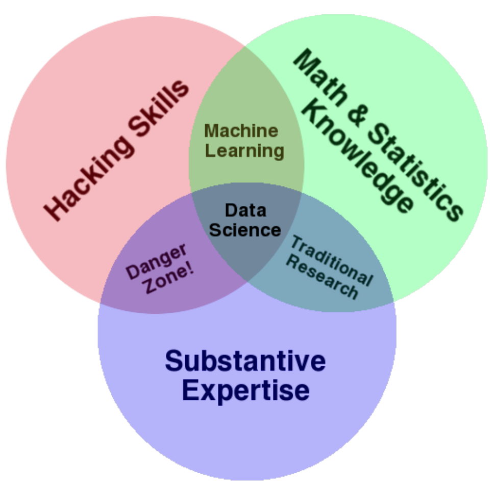
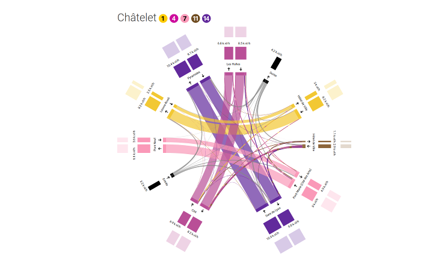

```{r setup, include=FALSE}
knitr::opts_chunk$set(echo = FALSE)
```
## Data Science ?

*The next sexy job*

*The ability to take data to be able to understand it, to process 
it, to extract value from it, to visualize it, to communicate it,
that’s going to be a hugely important skill.*

**-- Hal Varian, Google**

## Data Science ?

*Data science, as it's practiced, is a blend of Red-Bull-fueled 
__hacking__ and espresso-inspired __statistics__.*

*Data science is the civil engineering of data. Its acolytes 
possess a practical knowledge of tools & materials, coupled 
with a theoretical understanding of what's possible*

**-- Mike Driscoll, CEO of metamarkets**


## <span style="color:#000">Drew Conway’s Data Science Venn Diagram </span> {data-background=#ffffff}
<div style="text-align:center">

</div>


## Data Science ?

*A data scientist is someone who can obtain, scrub, explore, model 
and interpret data, blending hacking, statistics and machine 
learning. Data scientists not only are adept at working with data, but 
appreciate data itself as a first-class product.*

**-- Hilary Mason, chief scientist at bit.ly**


## Data Science?

*Talking about data also evokes the __datascientist__, this five-legged sheep of data with __statistical, computer skills__, perfectly understanding __the business stakes__ of the company... Is he also a fantasy of the ambient discourse on big data ?*

## Data Science?

*While there may exist profiles that come close to this description, reality shows most often that datascience, like science in general, does not happen alone but __in a group__.(...) *

*Another little-known fact about the datascientist is that he is first and foremost a __craftsman's trade__. Each problem and each dataset always requires a specific approach that cannot be industrialized, which many people still don't understand.*


## A fashion with ancient origins 
<div style="text-align:center"></br>
<a href="http://fr.wikipedia.org/wiki/Johannes_Kepler">Johann Kepler</a></div>

## A fashion with ancient origins 
<div style="text-align:center"></br>
<a href="https://en.wikipedia.org/wiki/Charles_Joseph_Minard">Charles Joseph Minard</a></div>

## A fashion with ancient origins 
<div style="text-align:center"></br>
<a href="https://en.wikipedia.org/wiki/Charles_Joseph_Minard">Charles Joseph Minard</a></div>

## A fashion with ancient origins 
<div style="text-align:center">
</br>
<a href="https://en.wikipedia.org/wiki/William_Sealy_Gosset">William Sealy Gosset (Student)</a></div>


## Key competencies

### 1. Prepare data (DB) 
Recover, mix, enrich, filter, clean, verify, format, transform data...

### 2. Models (ML/Stats)
Decision tree, regression, clustering, graphical model, SVM...

### 3. Interpret/share (Visualisation) 
Graphics, Data visualization, Maps...

## Key competencies
### 1. Prepare data (DB) -- 80% of the job
Recover, mix, enrich, filter, clean, verify, format, transform data...

### 2. Implementing a method a model (ML/Stats)
Decision tree, regression, clustering, graphical model, SVM...

### 3. Interpret/share (Visualisation) -- 80% of the job
Graphics, Data visualization, Maps...


## Key competencies
### 1. Data Munging 
Retrieve, mix, enrich, filter, clean, verify, format, transform data

### 2. Statistics 
Traditional data analysis 

### 3. Visualisation 
Graphics, Data visualization, Maps...


## Course Outline


<ul>
<li> handling R data with dplyr  
<li> introduction to visualization, good practices & common mistakes</li>
<li> ggplot and grammar of graphics </li>
<li> spatial data </li>
<li> introduction to cartography </li>
</ul>


## {data-background="images/lbcbig.jpg"}

<h1 style="color:#000">Some projects </h1>
<h4 style="text-align:center" class="shadow"><a href="http://www.comeetie.fr/galerie/leboncoin/">
http://www.comeetie.fr/galerie/leboncoin/</a></h4>


## {data-background="#fff"}
<h1 style="color:#000">Some projects </h1>
<div style="text-align:center">
<a href="https://www.comeetie.fr/galerie/sankeystif/">
</img>
<h4 style="text-align:center">https://www.comeetie.fr/galerie/sankeystif/</h4>
</a>
</div>
