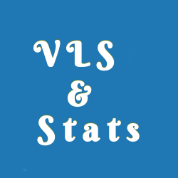
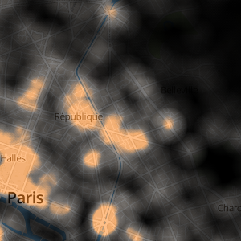

```{r setup, include=FALSE}
knitr::opts_chunk$set(echo = FALSE)
```

## Data Science ?

*The next sexy job*

*The ability to take data to be able to understand it, to process 
it, to extract value from it, to visualize it, to communicate it,
that’s going to be a hugely important skill.*

**-- Hal Varian, Google**

## Data Science ?

*Data science, as it's practiced, is a blend of Red-Bull-fueled 
__hacking__ and espresso-inspired __statistics__.*

*Data science is the civil engineering of data. Its acolytes 
possess a practical knowledge of tools & materials, coupled 
with a theoretical understanding of what's possible*

**-- Mike Driscoll, CEO of metamarkets**


## <span style="color:#000">Drew Conway’s Data Science Venn Diagram </span> {data-background=#ffffff}
<div style="text-align:center">

</div>


## Data Science ?

*A data scientist is someone who can obtain, scrub, explore, model 
and interpret data, blending hacking, statistics and machine 
learning. Data scientists not only are adept at working with data, but 
appreciate data itself as a first-class product.*

**-- Hilary Mason, chief scientist at bit.ly**

## Data Science ?
*Parler de la donnée, c'est aussi évoquer le datascientist, ce mouton à 5 pattes de la data disposant de compétences statistiques, informatiques, comprenant parfaitement les enjeux métier de l'entreprise... Est-il aussi un fantasme du discours ambiant sur le big data ?*

*S'il peut exister des profils qui s'approchent de cette description, la réalité démontre le plus souvent que la datascience, comme la science en générale, ne se produit pas seule mais en groupe. La bonne question à se poser est donc plutôt celle de la synchronisation des différentes compétences au sein de l'organisation. Nous plaidons davantage pour un datascientism que pour des datascientists.*

*Une autre réalité méconnue sur le datascientist est qu'il s'agit avant tout d'un métier d'artisan. Chaque problème et chaque jeu de données demande toujours une démarche spécifique qui n'est pas industrialisable, ce que beaucoup de gens ne comprennent pas encore.*


## Une mode avec des origines anciennes 
<div style="text-align:center"></br>
<a href="http://fr.wikipedia.org/wiki/Johannes_Kepler">Johann Kepler</a></div>

## Une mode avec des origines anciennes 
<div style="text-align:center"></br>
<a href="https://en.wikipedia.org/wiki/Charles_Joseph_Minard">Charles Joseph Minard</a></div>

## Une mode avec des origines anciennes 
<div style="text-align:center"></br>
<a href="https://en.wikipedia.org/wiki/Charles_Joseph_Minard">Charles Joseph Minard</a></div>

## Une mode avec des origines anciennes 
<div style="text-align:center">
</br>
<a href="https://en.wikipedia.org/wiki/William_Sealy_Gosset">William Sealy Gosset (Student)</a></div>


## Des compétences clés

### 1. Préparer les données (DB) 
Récupérer, mélanger, enrichir, filtrer, nettoyer, vérifier, formater, transformer des données...

### 2. Mettre en œuvre une méthode un modèle (ML/Stats)
Arbre de décision, régression, clustering, Modèle graphique, SVM...

### 3. Interpréter les résultats (Vis) 
Graphiques, Data visualisation, Cartes...

## Des compétences clés
### 1. Préparer les données (DB) -- 80% du boulot
Récupérer, mélanger, enrichir, filtrer, nettoyer, vérifier, formater, transformer des données...

### 2. Mettre en œuvre une méthode un model (ML/Stats)
Arbre de décision, régression, clustering, Modèle graphique, SVM...

### 3. Interpréter les résultats (Vis) -- 80% du boulot
Graphiques, Data visualisation, Cartes...


## Des compétences clés
### 1. Data Munging 
Récupérer, mélanger, enrichir, filtrer, nettoyer, vérifier, formater, transformer des données

### 2. Statistiques 
Analyse de données traditionnelle 

### 3. Visualisation 
Graphiques, Data visualisation, Cartes...


## Plan du cours


<ul>
<li>manipuler des données en R avec dplyr  
<li>introduction à la visualisation, bonnes pratiques & erreurs communes</li>
<li>ggplot et la grammaire graphique </li>
<li>données spatiales </li>
<li>introduction à la cartographie </li>
</ul>


## {data-background="images/lbcbig.jpg"}

<h1 style="color:#000">Quelques exemples de projets </h1>
<h4 style="text-align:center" class="shadow"><a href="http://www.comeetie.fr/map_lbc.php">
http://www.comeetie.fr/map_lbc.php</a></h4>


## {data-background="images/francepixelsbig.jpg"}

<h1 style="color:#000">Quelques exemples de projets </h1>
<h4 style="text-align:center" class="shadow"><a href="http://www.comeetie.fr/galerie/francepixels/">
http://www.comeetie.fr/galerie/francepixels/</a></h4>


## {data-background="images/francepixelsbig.jpg"}
<h1 style="color:#000">Quelques exemples de projets </h1>
<h4 style="text-align:center" class="shadow"><a href="http://www.comeetie.fr/galerie/francepixels/">
http://www.comeetie.fr/galerie/francepixels/</a></h4>

## {data-background="#fff"}
<h1 style="color:#000">Quelques exemples de projets </h1>
<div style="text-align:center">
<a href="http://vlsstats.ifsttar.fr/">
</img>
<h4 style="text-align:center">http://vlsstats.ifsttar.fr/</h4>
</a>
</div>

## {data-background="#fff"}
<h1 style="color:#000">Quelques exemples de projets </h1>
<div style="text-align:center">
<a href="http://vlsstats.ifsttar.fr/atNight/">
</img>
<h4 style="text-align:center">http://vlsstats.ifsttar.fr/atNight/</h4>
</a>
</div>

## {data-background="#fff"}
<h1 style="color:#000">Quelques exemples de projets </h1>
<div style="text-align:center">
<a href="https://www.comeetie.fr/galerie/sankeystif/l">
</img>
<h4 style="text-align:center">https://www.comeetie.fr/galerie/sankeystif/</h4>
</a>
</div>
