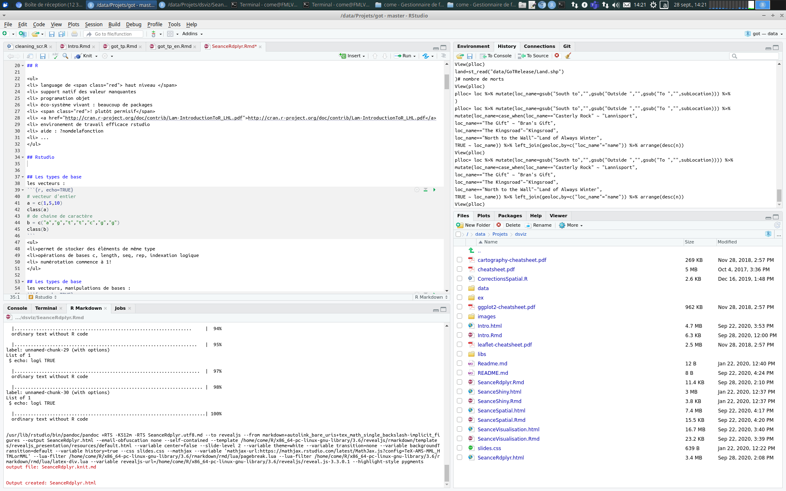
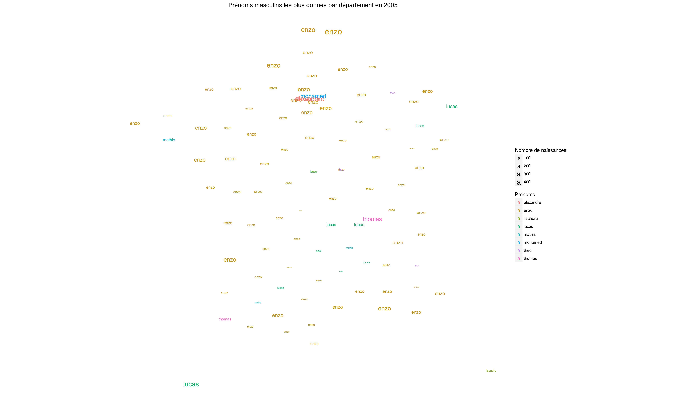

```{r setup, include=FALSE}
knitr::opts_chunk$set(echo = FALSE)
```

## R

<ul>
<li> language of <span class="red"> high level </span> 
<li> native support for missing values
<li> object programming
<li> living eco-system: a lot of packages 
<li> <span class="red">! rather permissive</span> 
<li> <a href="http://cran.r-project.org/doc/contrib/Lam-IntroductionToR_LHL.pdf">http://cran.r-project.org/doc/contrib/Lam-IntroductionToR_LHL.pdf</a>
<li> efficient work environment rstudio
<li>help: ?nameoffunction
<li> ...
</ul>

## Rstudio

https://learnr-examples.shinyapps.io/ex-setup-r/

## R & Rstudio install
<h4> Download and install R</h4>
https://cloud.r-project.org/

<h4> Download and install Rstudio</h4>
https://rstudio.com/products/rstudio/download/

<h4> Install packages</h4>
<pre><code class="r">install.packages("dplyr")
install.packages("readr")
install.packages("tidyr")
install.packages("ggplot2")
</pre></code>

## Basic types
the vectors :
```{r, echo=TRUE}
# integer vector
a = c(1,5,10)
class(a)
# character vector 
b = c("a", "g", "t", "c", "g")
class(b)
```
<ul>
<li>allows to store elements of the same type
<li> basic operations c, length, seq, rep, logical indexing
<li> numbering starts at 1!
</ul>

## Basic types
vectors, basic manipulations :
```{r, echo=TRUE}
length(a)
a[1:2]
i = 1:2;
a[i]
i = (b=="g")
b[i]
```


## Basic types
vectors, basic manipulations :
```{r, echo=TRUE}
i = seq(1,length(b),2);b [i]
i = rep(1.5);b[i]
i = rep(c(1,2),5);b[i]
i = rep(c(1,2),each=3);b[i]
```


## Basic types, factors :
vectors, basic manipulations:
```{r, echo=TRUE}
b = c("a", "g", "t", "c", "g")
c = factor(b,levels=c("a", "t", "g", "c"))
levels(c)
unclass(c)
```
<ul>
<li>special type of vectors for coding categorical variables "the levels".
<li>basic operations c, length, levels, unclass
<li><span class="red">! interpretation of strings as factors when creating a data.frame</span>
</ul>


## Basic types
<h4> Matrix :</h4>
```{r, echo=TRUE}
# integer matrix
a = matrix(c(1,5,10,10),2,2)
# of string 
b = rbind(c("a", "g"),c("t", "t"),c("c", "g"))
c = cbind(c("a", "g"),c("t", "t"),c("c", "g"))
```
<ul>
<li> allows to store elements of the same type
<li> basic operations dim, rbind, cbind, logical indexing
</ul>

## Basic types
<h4> Matrix :</h4>
```{r, echo=TRUE}
dim(b)
t(b)
dim(t(b))
a[1,]
b[,2]
c[c[,1]=="a",]
```
<ul>
<li>allows to store elements of the same type
<li> basic operations dim, rbind, cbind, logical indexing
</ul>


## Basic types
<h4>The arrays :</h4>

```{r, echo=TRUE, eval=FALSE}
# Tensor 3 dimensions
a = array(runif(50),dim=c(5,5,2))
a[1,,]
a[,5,]
a[,2,1]
```
<ul>
<li>allows to store elements of the same type
<li>basic operations dim, logical indexing
</ul>


## Basic types
</h4> Lists :</h4>

```{r, echo=TRUE}
l = list(a,b,c)
length(l)
l[[2]]
l = list(a=a,b=b,c=c)
```
<ul>
<li>allows to store elements of different types
<li> base operations length, c
</ul>

## Basic types
</h4> Lists :</h4>

```{r, echo=TRUE}
l$c
l[[2]]
```
<ul>
<li>allows to store elements of different types
<li>base operations length, c
</ul>


## Basic types
<h4> The data.frame :</h4>

```{r, echo=TRUE,results='hide'}
d = data.frame(v1=rep("a",10),v2=1:10,v3=runif(10))
dim(d)
d$v1
d$v4 = factor(rep(c("a", "b"),5),levels=c("a", "b"))
d[d$v4=="a",]
d[, "v2"]
d[,c(3,1)]
d[,c("v2", "v4")]
names(d)
summary(d)
```


<ul>
<li>allows to store elements of different types
<li>= list of named vectors indexable and manipulable as a matrix
<li>basic operations dim, cbind, rbind, names, summary
</ul>

## Functions
```{r, echo=TRUE,results='hide'}
f = function(a,b){
  return(a-b)
}
f(5,6)
f(b=5,a=6)
f = function(a=32,b=12){
  a-b
}
f()
f(5,6)
f(b=5,a=6)
```
<ul>
<li> named argument and default value
<li> no need for explicit return
</ul>


## Read data
<pre><code class="r">
data = read.table("filename")
data = read.csv("filename")
# performant version
library(readr)
data = read_csv("filname")
data = read_delim("filename")
</pre></code>

## Loops and flow control
```{r, echo=TRUE,results='hide'}
for (i in 1:length(a)){}
while(i > 4){i=i-1}
```
<span class="red">! avoid for loops  (vectorial operations) </span>

```{r, echo=TRUE}
a=runif(100000)
t=Sys.time()
for (i in 1:length(a)){a[i]=a[i]+5}
t1=Sys.time()-t
t1
```

## Loops and flow control
```{r, echo=TRUE,results='hide'}
for (i in 1:length(a)){}
while(i > 4){i=i-1}
```
<span class="red">! avoid for loops  (vectorial operations) </span>

<span class="green">Vectorial version</span>
```{r, echo=TRUE}
t=Sys.time()
a=a+5
t2=Sys.time()-t
t2
as.numeric(t1)/as.numeric(t2)
```


## Some vector functions
sum, cumulated sum (cumsum), finite differences (diff), max, min ...
```{r, echo=TRUE,results='hide'}
a=data.frame(v1=runif(5000),v2=rnorm(5000),v3=rbinom(5000,5,0.2))
# basic algebraic operation
a$v1+a$v2;a$v1*a$v2;a$v1/a$v2

# matrix product
t(a$v1)%*%a$v2

# sum and cumulative sum
sum(a$v2);cumsum(a$v1)

# difference
diff(a$v2)
```

## Some vector functions
sum, cumulated sum (cumsum), finite differences (diff), max, min ...
```{r, echo=TRUE,results='hide'}
# max, min ....
max(a$v3)
which.max(a$v1)
which(a$v1>0.2)

# string concatenation
paste(a$v1,a$v2);paste0(a$v1,a$v2)

# are on the matrices
b=matrix(runif(100),10,10)
sum(b);rowSums(b);colSums(b)
```

## Apply, lapply, sapply
Apply a function to each element of an object
```{r, echo=TRUE,results='hide'}
a=data.frame(v1=runif(5000),v2=rnorm(5000),v3=rbinom(5000,5,0.2))
# apply to each line
r=apply(a,1,sum)
head(r);class(r);dim(r)

# apply to each column
r=apply(a,2,function(col){c(max(col),which.max(col))})
r;class(r);dim(r)

# apply to all elements of a list
b=list(v1=runif(5000),v2=rnorm(5000),v3=rbinom(5000,5,0.2))
r=lapply(b,which.max)
r;class(r)
# simplification of the result
r=sapply(b,which.max)
r;class(r)
```
<span class="red">preferable to loops...</span>


## Subset: sample, logical indexing
Select a part of the data
```{r, echo=TRUE}
#logical indexing
a[a$v1>0.98 & a$v3==3,]

#substitute function
subset(a,v1>0.98 & v3==3)
```

## Binning: cut
Pretreat variables to construct factors // intervals
```{r, echo=TRUE}
r=cut(a$v2,c(-Inf,-3,-2,2,1,Inf))
class(r);head(r)
```


## Match, %in%, setdiff, intersect
```{r, echo=TRUE}
a = 10:100
b = 50:110
setdiff(a,b)
intersect(a,b)
```

## Match, %in%, setdiff, intersect
```{r, echo=TRUE}
a = 10:100
b = 50:110
a %in% b
match(a,b)
```


## Counting: table
```{r, echo=TRUE}
data = data.frame(v1=rep(c("a","t","g","c"),500/4),v2=rbinom(500,10,0.4))
table(data$v1)
table(data[,c('v1', 'v2')])
```


## <span class="green">dplyr,tidyr</span>
2 libraries for easy data manipulation
(<a href="./data-transformation.pdf">Cheatsheet</a>)</br>
! Introduction of a new operator !</br>.
Sequence of operations  : introduction of the pipe operator :

<h1 class="red" style="text-align:center">%&gt;% 
</h1>
<pre><code class="r"> x%&gt;% f(y) =f(x,y) </pre></code>
<pre><code class="r"> x%&gt;% f(y) %&gt;% g(z) = g(f(x,y),z) </pre></code>
Easy to write, Easy to read


## <span class="green">dplyr,tidyr</span>
<h2>Selection of lines "filter"</h2>
<pre><code class="r">data %&gt;% filter(condition)
data %>% distinct(v1)
data %>% sample_n(15,replace=FALSE)
data %>% sample_frac(0.2)
data %>% top_n(5,v1)
data %>% slice(20:30)</pre></code>


## <span class="green">dplyr,tidyr</span>
<h2>Column selection "select"</h2>
<pre><code class="r">data %&gt;% select(v1,v2)
data %&gt;% select(contains('var'))
data %&gt;% select(-v3)
data %>% pull(v3)
...</pre></code> ...</pre></code> ...</pre></code> ...</pre></code>...


## <span class="green">dplyr,tidyr</span>

<h2> Transformation "mutate"</h2>
<pre><code class="r">data %&gt;% mutate(v3=v1/v2)
</pre></code>

<pre><code class="r"> data %&gt;% rename(v4=v1)
</pre></code>

<pre><code class="r"> data %&gt;% arrange(v4)
data %&gt;% arrange(desc(v4))
</pre></code>


## <span class="green">dplyr,tidyr</span>
<h2> "summarizes"</h2>
<pre><code class="r">data %&gt;% summarize(v1m=mean(v1))
</pre></code>
<h2> With grouped data "group_by"</h2>
<pre><code class="r">data %&gt;% group_by(group) %>% summarise(v1m=mean(v1))
data %&gt;% group_by(group) %>% summarise(v1med=median(v1))
</pre></code>
Aggregation function : mean,median,n,sum,max,min,...
Shortcut
<pre><code class="r">
data %&gt;% goup_by(v4) %>% summarize(n=n())
data %&gt;% count(v4)
</pre></code>


## <span class="green">dplyr,tidyr</span>
<h2> vector functions</h2>
<pre><code class="r"> 
data1 %&gt;% mutate(v2=cumsum(v1))
data1 %&gt;% mutate(v2=if_else(v1==32, "a", "b"))
data1 %&gt;% mutate(v2=case_when(v1==32 ~ "a",v1==33 & v4<5 ~"b", TRUE ~ c))
</pre></code>

<h2>offset</h2>
<pre><code class="r"> 
data1 %&gt;% mutate(v2=lag(v1))
data1 %&gt;% mutate(v2=lead(v4))
</pre></code>

! after a group_by to mutate by groups.

## <span class="green">dplyr,tidyr</span>
<h2>Join tables : "X_join"</h2>
<pre><code class="r"> 
data1 %&gt;% left_join(data2, by=c("v1"="v2"))
data1 %&gt;% right_join(data2)
data1 %&gt;% inner_join(data2)
data1 %&gt;% full_join(data2)
</pre></code>


## <span class="green">dplyr,tidyr</span>
<h2>long format </h2>
```{r, echo=FALSE,message=FALSE,comment=FALSE}
library(dplyr)
library(tidyr)
```
```{r, echo=TRUE}
library(dplyr)
library(tidyr)
df=expand_grid(year=2015:2020,countries=c("France", "Italy", "Morocco"))
df$value=runif(nrow(df))
df
```


## <span class="green">dplyr,tidyr</span>
Fitness </h2> Fitness </h2>
<ul>
<li>tidyr::pivot_long: wide format -> long format
<li>tidyr::pivot_wider: long format -> wide format
<li> tidyr::separate: split of u
<li>tidyr::unite: concatenation of columns
</ul>


## <span class="green">dplyr,tidyr</span>
<h2>long format -> wide format</h2>

```{r, echo=TRUE}
dflarge = df %>% pivot_wider(names_from = year,values_from = value)
dflarge
```

## <span class="green">dplyr,tidyr</span>
<h2>Wide format -> long format</h2>
```{r, echo=TRUE}
dflong = dflarge %>% pivot_longer(cols = -1,values_to = "value",names_to = "year")
dflong
```

## More 

https://r4ds.had.co.nz/

## <span class="green">dplyr,tidyr, exercises</span>
Exercise 1, 2 and 3 of GoT:
<a href="https://comeetie.github.io/got/got_tp.html">https://comeetie.github.io/got/got_tp.html</a>


## <span class="green">dplyr,tidyr, extra exercise</span>
<h2>Baby names</h2>
Make a card representing the male first names most frequently given to children born in 2005 for all French departments.
The data to be used are available in the data directory:

- <a href="./Data/exo5_dep.csv">./Data/exo5_dep.csv : centroid des départements</a>. 
- <a href="./Data/exo5_dep.csv">./Data/exo5_first names.csv: First names file</a> 

## <span class="green">dplyr,tidyr, exercise</span> {data-background=#ffffff}


