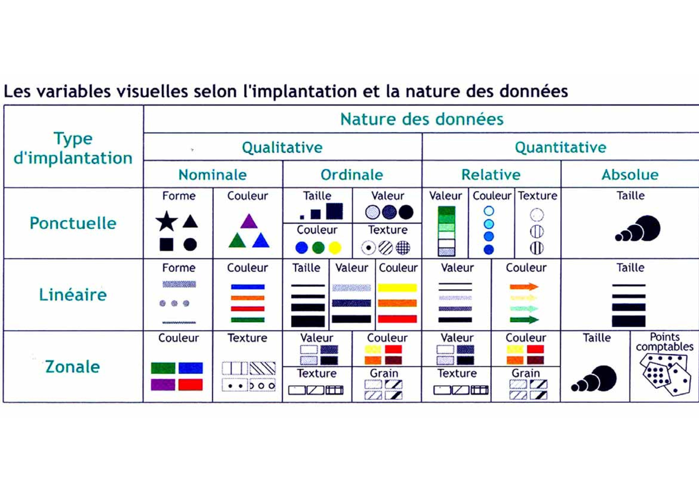
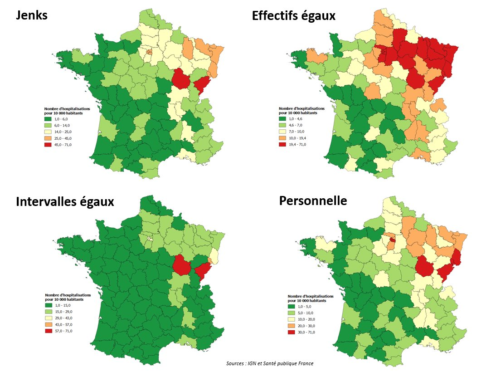

```{r setup, include=FALSE}
knitr::opts_chunk$set(echo = FALSE)
```


## Packages historique
<link href="https://fonts.googleapis.com/css?family=Armata&display=swap" rel="stylesheet">


* `rgdal`: interface entre R and [GDAL](http://www.gdal.org/) (Geospatial Data Abstraction Library) and [PROJ4](https://github.com/OSGeo/proj.4) librarie: raster / vector 

* `sp`: classes d'objets spatiaux pour R. (S4)

* `rgeos`: interface entre R et [GEOS](http://trac.osgeo.org/geos/) (Geometry Engine - Open Source) library: area, perimeter, distances, dissolve, buffer, overlap, union, contains... 

Toujours utilisé

## Simple Features for R

* `sf`  Website: [Simple Features for R](https://r-spatial.github.io/sf/index.html) Octobre 2016  

* `sp`, `rgeos` and `rgdal` tout dans le même package 

* Plus simple

* [Tidy data](http://vita.had.co.nz/papers/tidy-data.html): compatible `dplyr`.


## Simple Features for R
**sf objects data structure:**


- metadata 
- geom column avec des géomtrie stockées au format Well-known_text (wkt) 

## Lire des données
Capable de lire n'importe quel format de données spatiale : shp, geojson, kml
```{r,echo=TRUE,warning=FALSE,message=FALSE,results='hide'}
library(sf)
mtq <- st_read("data/mtq/martinique.shp")
```
```{r,echo=TRUE}
class(mtq)
str(mtq)
```


## Changer la projection ou passer en lat/long
```{r,echo=TRUE,warning=FALSE,fig.height=4.5}
mtq_rp = st_transform(mtq,4326)
mtq_rp
```

## Système de coordonées
Les projections/système de coordonées sont répertoriées grâce à un code le code epsg :

- lat/long : 4326 https://epsg.io/4326
- Lambert 93 : 2154 https://epsg.io/2154
- Pseudo-Mercator : 3857 https://epsg.io/3857
- Lambert azimuthal equal area : 3035 https://epsg.io/3035

Préservations ? angles, aires, distance locales, ...
 

## Affichage

```{r,echo=TRUE,warning=FALSE,fig.height=4.5}
plot(mtq)
```

## Affichage, seulement la géométrie
```{r, echo=TRUE,warning=FALSE,fig.height=4.5}
plot(st_geometry(mtq))
```

## Suppression de la géométrie
```{r, echo=TRUE,warning=FALSE,fig.height=4.5}
mtq %>% st_drop_geometry()
mtq
```


## Centroids 
```{r, echo=TRUE,warning=FALSE,message=FALSE,fig.show='last',fig.height=4.5}
mtq_c <- st_centroid(mtq)
plot(st_geometry(mtq))
plot(st_geometry(mtq_c), add=TRUE, cex=1.2, col="red", pch=20)
```

## Distances
```{r, echo=TRUE,warning=FALSE,message=FALSE}
mat <- st_distance(x=mtq_c,y=mtq_c)
mat[1:5,1:5]
```

## Polygons Aggregation, union :
```{r, echo=TRUE,warning=FALSE,message=FALSE,fig.show='last',fig.height=4.5}
mtq_u <- st_union(mtq)
plot(st_geometry(mtq), col="lightblue")
plot(st_geometry(mtq_u), add=T, lwd=2, border = "red")
```

## Polygons Aggregation, 
avec une variable de groupe :
```{r, echo=TRUE,warning=FALSE,message=FALSE,fig.show='last',fig.height=4.5}
library(dplyr)
mtq_u2 <- mtq %>% 
  group_by(STATUT) %>% 
  summarize(P13_POP=sum(P13_POP))
plot(st_geometry(mtq), col="lightblue")
plot(st_geometry(mtq_u2), add=T, lwd=2, border = "red", col=NA)
```

## Buffer 
```{r, echo=TRUE,warning=FALSE,message=FALSE,fig.show='last',fig.height=4.5}
mtq_b <- st_buffer(x = mtq_u, dist = 5000)
plot(st_geometry(mtq), col="lightblue")
plot(st_geometry(mtq_u), add=T, lwd=2)
plot(st_geometry(mtq_b), add=T, lwd=2, border = "red")

```


## Polygon Intersection 
```{r, echo=TRUE,warning=FALSE,message=FALSE,fig.show='last',fig.height=4.5}
m <- rbind(c(700015,1624212), c(700015,1641586), c(719127,1641586), 
           c(719127,1624212), c(700015,1624212))
p <- st_sf(st_sfc(st_polygon(list(m))), crs = st_crs(mtq))
plot(st_geometry(mtq))
plot(p, border="red", lwd=2, add=T)
```

## Polygon Intersection 
```{r, echo=TRUE,warning=FALSE,message=FALSE,fig.show='last',fig.height=4.5}
mtq_z <- st_intersection(x = mtq, y = p)
plot(st_geometry(mtq))
plot(st_geometry(mtq_z), col="red", border="green", add=T)
```

## Autre traitements

- st_area(x)
- st_length(x)


## Autre traitements

- st_disjoint(x, y, sparse = FALSE)
- st_touches(x, y, sparse = FALSE)
- st_crosses(s, s, sparse = FALSE)
- st_within(x, y, sparse = FALSE)
- st_contains(x, y, sparse = FALSE)
- st_overlaps(x, y, sparse = FALSE)
- st_equals(x, y, sparse = FALSE)
- st_covers(x, y, sparse = FALSE)
- st_covered_by(x, y, sparse = FALSE)
- st_covered_by(y, y, sparse = FALSE)
- st_equals_exact(x, y,0.001, sparse = FALSE)
- ...


## Jointure spatiale

- st_join


## Voronoi Polygons  
<small>google: "st_voronoi R sf" (https://github.com/r-spatial/sf/issues/474 & https://stackoverflow.com/questions/45719790/create-voronoi-polygon-with-simple-feature-in-r)
</small>
```{r, echo=TRUE,warning=FALSE,message=FALSE,fig.show='last',fig.height=4.5}
mtq_v <- st_voronoi(x = st_union(mtq_c))
mtq_v <- st_intersection(st_cast(mtq_v), st_union(mtq))
mtq_v <- st_join(x = st_sf(mtq_v), y = mtq_c, join=st_intersects)
mtq_v <- st_cast(mtq_v, "MULTIPOLYGON")
plot(st_geometry(mtq_v), col='lightblue')
```

## Ecrire des données

```{r, echo=TRUE,warning=FALSE,message=FALSE,fig.show='last',fig.height=4.5}
system("rm data/voronoi.geojson")
write_sf(mtq_v,"./data/voronoi.geojson",driver="GeoJSON")
```


## Cartographie


## Cartgographie avec ggplot
```{r, echo=TRUE,warning=FALSE,message=FALSE,fig.show='last',fig.height=4.5}
library(sf)
# Import geo layers
# Communes of Seine Maritime
sm <- st_read(dsn = "data/seine_maritime.geojson", 
              stringsAsFactors = F, quiet=TRUE)
# French departements
dep <- st_read(dsn = "data/dep.geojson", 
               stringsAsFactors = F, quiet=TRUE)
# change projection (lambert93)
sm <- st_transform(sm, 2154)
dep <- st_transform(dep, 2154)
# Import dataset  
csp <- read.csv("data/data_seine_maritime.csv")
# merge geolayer and dataset
sm <- merge(sm, csp, by="INSEE_COM", all.x=TRUE)
```


## Cartgographie avec ggplot

- ?geom_sf
- ?geom_sf_label
- ?geom_sf_text
- ?coord_sf


## Cartographie avec ggplot
```{r, echo=TRUE,warning=FALSE,message=FALSE,fig.show='last',fig.height=4.5}
library(ggplot2)
ggplot()+geom_sf(data=dep,fill="ivory",color="ivory3")+
  geom_sf_text(data=dep %>% filter(CODE_REG!=11),aes(label=CODE_DEPT),size=3,family="Palatino", fontface="bold")
```

## Cartographie avec ggplot
```{r, echo=TRUE,warning=FALSE,message=FALSE,fig.show='last',fig.height=4.5}
library(ggplot2)
bb = st_bbox(sm)
ggplot()+geom_sf(data=dep,fill="ivory",color="ivory3")+
  geom_sf(data = sm %>% st_centroid,aes(size=act))+
  coord_sf(xlim=bb[c(1,3)],ylim=bb[c(2,4)],ndiscr = 0)
```

## Cartographie avec ggplot
```{r, echo=TRUE,warning=FALSE,message=FALSE,fig.show='hide',fig.height=4.5}
library(ggplot2)
bb = st_bbox(sm)
cols <- c("#e3b4a2", "#a2d5d6", "#debbd4", 
           "#afc2e3", "#b5dab6","#e9e2c1")
modlab <- c("Agriculteurs", "Artisans","Cadres", 
             "Employés","Prof. Inter.", "Ouvriers")
names(cols)=modlab

levels(sm$cat)=modlab
ggplot()+geom_sf(data=dep,fill="ivory",color="ivory3")+
  geom_sf(data = sm,aes(fill=cat),size=0.1)+
  scale_fill_manual("Dominant Socio-Professional\nCategory",values=cols)+
  theme_minimal()+
  coord_sf(xlim=bb[c(1,3)],ylim=bb[c(2,4)],ndiscr = 0)

```


## Cartographie avec ggplot
```{r, echo=FALSE,warning=FALSE,message=FALSE,fig.show='last',fig.height=4.5}
library(ggplot2)
bb = st_bbox(sm)
cols <- c("#e3b4a2", "#a2d5d6", "#debbd4", 
           "#afc2e3", "#b5dab6","#e9e2c1")
modlab <- c("Agriculteurs", "Artisans","Cadres", 
             "Employés","Prof. Inter.", "Ouvriers")
names(cols)=modlab

levels(sm$cat)=modlab
ggplot()+geom_sf(data=dep,fill="ivory",color="ivory3")+
  geom_sf(data = sm,aes(fill=cat),size=0.1)+
  scale_fill_manual("Dominant Socio-Professional\nCategory",values=cols)+
  theme_minimal()+
  coord_sf(xlim=bb[c(1,3)],ylim=bb[c(2,4)],ndiscr = 0)

```

## Choroplethe et discretisation

  
  
## Cartographie avec ggplot
```{r, echo=TRUE,warning=FALSE,message=FALSE,fig.height=4.5}
hist(sm$cad/sm$act,25)
```

## Cartographie avec ggplot
```{r, echo=FALSE,warning=FALSE,message=FALSE,fig.show='last',fig.height=4.5}

sm = sm %>% mutate(manshare = cad/act*100, mansharecat = cut(manshare,quantile(manshare,seq(0,1,length.out = 7)),include.lowest=TRUE))

ggplot()+geom_sf(data=dep,fill="ivory",color="ivory3")+
  geom_sf(data = sm,aes(fill=mansharecat),size=0.1)+
  scale_fill_brewer("Share of Manager (%)",palette="RdYlGn",direction = -1)+
  theme_minimal()+
  coord_sf(xlim=bb[c(1,3)],ylim=bb[c(2,4)],ndiscr = 0)

```

## Carte plus complexes
```{r, echo=TRUE,warning=FALSE,message=FALSE,fig.show='last',fig.height=4.5}
library(sf)
# Import geo layers
# Communes of Seine Maritime
sm <- st_read(dsn = "data/seine_maritime.geojson", 
              stringsAsFactors = F, quiet=TRUE)
# French departements
dep <- st_read(dsn = "data/dep.geojson", 
               stringsAsFactors = F, quiet=TRUE)
# change projection (lambert93)
sm <- st_transform(sm, 2154)
dep <- st_transform(dep, 2154)
# Import dataset  
csp <- read.csv("data/data_seine_maritime.csv")
# merge geolayer and dataset
sm <- merge(sm, csp, by="INSEE_COM", all.x=TRUE)
```


## Carte simple symboles proportionels 
```{r, echo=TRUE,fig.show='hide'}
library(cartography)
plot(st_geometry(sm))
propSymbolsLayer(sm, var = "act")
title("Active Population")
```

## Carte simple symboles proportionels 
```{r, echo=FALSE,warning=FALSE,message=FALSE,fig.show='last',fig.height=5.5}
library(cartography)
plot(st_geometry(sm))
propSymbolsLayer(sm, var = "act")
title("Active Population")
```


## Carte symboles proportionels 
```{r, echo=TRUE,fig.show='hide'}
# Custom map of active population
par(mar=c(0.2,0.2,1.4,0.2))
bb <- st_bbox(sm)
# the bbox is used to center the map on the Seine Maritime depatement
plot(st_geometry(dep), col = "ivory", border="ivory3",  bg="azure", 
     xlim = bb[c(1,3)], ylim =  bb[c(2,4)])
plot(st_geometry(sm), col="cornsilk2", border = NA, lwd = 0.5, add=T)
propSymbolsLayer(sm, var = "act", col="darkblue", inches = 0.6, 
                 border = "white", lwd=0.7, symbols = "square",
                 legend.style = "e", legend.pos="topleft",
                 legend.title.txt = "Labor Force\n(2014)", 
                 legend.values.rnd = 0)
# Scale Bar
barscale(size = 10)
# North Arrow
north(pos = "topright", col = "darkblue")
# Full layout
layoutLayer(title = "Workforce in Seine-Maritime", 
            sources = "Insee, 2018", author = "Kim & Tim, 2018", 
            col = "darkblue", coltitle = "white", tabtitle = TRUE, 
            frame = TRUE, scale = NULL, north = FALSE)
 
title("Active Population")
```

## Carte symboles proportionels 
```{r, echo=FALSE,warning=FALSE,message=FALSE,fig.show='last',fig.height=5.5}
# Custom map of active population
par(mar=c(0.2,0.2,1.4,0.2))
bb <- st_bbox(sm)
# the bbox is used to center the map on the Seine Maritime depatement
plot(st_geometry(dep), col = "ivory", border="ivory3",  bg="azure", 
     xlim = bb[c(1,3)], ylim =  bb[c(2,4)])
plot(st_geometry(sm), col="cornsilk2", border = NA, lwd = 0.5, add=T)
propSymbolsLayer(sm, var = "act", col="darkblue", inches = 0.6, 
                 border = "white", lwd=0.7, symbols = "square",
                 legend.style = "e", legend.pos="topleft",
                 legend.title.txt = "Labor Force\n(2014)", 
                 legend.values.rnd = 0)
# Scale Bar
barscale(size = 10)
# North Arrow
north(pos = "topright", col = "darkblue")
# Full layout
layoutLayer(title = "Workforce in Seine-Maritime", 
            sources = "Insee, 2018", author = "Kim & Tim, 2018", 
            col = "darkblue", coltitle = "white", tabtitle = TRUE, 
            frame = TRUE, scale = NULL, north = FALSE)
 
title("Active Population")
```


## Carte qualitative
```{r, echo=TRUE,warning=FALSE,message=FALSE,fig.show='hide',fig.height=4.5}
#To display qualitative data modalities
mod <- c("agr", "art", "cad", "int", "emp", "ouv")
# labels in the legedn
modlab <- c("Agriculteurs", "Artisans","Cadres", 
            "Prof. Inter.", "Employés", "Ouvriers")
# colors
cols <- c("#e3b4a2", "#a2d5d6", "#debbd4", 
          "#b5dab6", "#afc2e3", "#e9e2c1")
par(mar=c(0.2,0.2,1.4,0.2))
plot(st_geometry(dep), col = "ivory", border="ivory3", bg="azure",
     xlim = bb[c(1,3)], ylim =  bb[c(2,4)])
typoLayer(sm, var = "cat", 
          border = "ivory", lwd = 0.5, 
          legend.values.order = mod,
          col = cols,
          add=TRUE, legend.pos = "n")
# functions are dedicated to legend display
legendTypo(title.txt = "Dominant Socio-Professional\nCategory", 
           col = cols, 
           categ = modlab, 
           nodata = F)
barscale(size = 10)
north(pos = "topright", col = "darkblue")
layoutLayer(title = "Workforce Distribution in Seine-Maritime", 
            sources = "Insee, 2018", author = "Kim & Tim, 2018", 
            col = "darkblue", coltitle = "white", tabtitle = TRUE,
            frame = TRUE, scale = NULL, north = FALSE)
```


## Carte qualitative
```{r, echo=FALSE,warning=FALSE,message=FALSE,fig.show='last',fig.height=4.5}


#To display qualitative data
# modalities
mod <- c("agr", "art", "cad", "int", "emp", "ouv")
# labels in the legedn
modlab <- c("Agriculteurs", "Artisans","Cadres", "Prof. Inter.", "Employés", "Ouvriers")
# colors
cols <- c("#e3b4a2", "#a2d5d6", "#debbd4", "#b5dab6", "#afc2e3", "#e9e2c1")

par(mar=c(0.2,0.2,1.4,0.2))
plot(st_geometry(dep), col = "ivory", border="ivory3", bg="azure",
     xlim = bb[c(1,3)], ylim =  bb[c(2,4)])
typoLayer(sm, var = "cat", 
          border = "ivory", lwd = 0.5, 
          legend.values.order = mod,
          col = cols,
          add=TRUE, legend.pos = "n")
# functions are dedicated to legend display
legendTypo(title.txt = "Dominant Socio-Professional\nCategory", 
           col = cols, 
           categ = modlab, 
           nodata = F)
barscale(size = 10)
north(pos = "topright", col = "darkblue")
layoutLayer(title = "Workforce Distribution in Seine-Maritime", 
            sources = "Insee, 2018", author = "Kim & Tim, 2018", 
            col = "darkblue", coltitle = "white", tabtitle = TRUE,
            frame = TRUE, scale = NULL, north = FALSE)


```


## Choroplete
```{r, echo=TRUE,warning=FALSE,message=FALSE,fig.show='hide'}
# Compute the share of "managers" in the active population
sm$pcad <- 100 * sm$cad / sm$act

# The getBreaks() function is used to classify the variable
bks <- getBreaks(v = sm$pcad, method = "quantile", nclass = 6)

# The carto.pal() function give access to various palettes
cols <- carto.pal("green.pal", 3,"wine.pal",3)

# Create the map
par(mar=c(0.2,0.2,1.4,0.2))
plot(st_geometry(dep), col = "ivory", border="ivory3", bg="azure",
     xlim = bb[c(1,3)], ylim =  bb[c(2,4)])
choroLayer(sm, var = "pcad", breaks = bks, 
           col = cols, border = "grey80", 
           legend.values.rnd = 1,
           lwd = 0.4, legend.pos = "topleft", 
           legend.title.txt = "Share of managers (%)", add=T)
# Add a layout
layoutLayer(title = "Managers", 
            sources = "Insee, 2018", author = "Kim & Tim, 2018", 
            theme = "green.pal", 
            col = "darkred", coltitle = "white", 
            tabtitle = TRUE, 
            frame = TRUE, scale = 10)
north(pos = "topright")
```

## Choroplethe
```{r, echo=FALSE,warning=FALSE,message=FALSE,fig.show='last',fig.height=4.5}
# Compute the share of "managers" in the active population
sm$pcad <- 100 * sm$cad / sm$act

# The getBreaks() function is used to classify the variable
bks <- getBreaks(v = sm$pcad, method = "quantile", nclass = 6)

# The carto.pal() function give access to various cartographic color palettes
cols <- carto.pal("green.pal", 3,"wine.pal",3)

# Create the map
par(mar=c(0.2,0.2,1.4,0.2))
plot(st_geometry(dep), col = "ivory", border="ivory3", bg="azure",
     xlim = bb[c(1,3)], ylim =  bb[c(2,4)])
choroLayer(sm, var = "pcad", breaks = bks, 
           col = cols, border = "grey80", 
           legend.values.rnd = 1,
           lwd = 0.4, legend.pos = "topleft", 
           legend.title.txt = "Share of managers (%)", add=T)
# Add a layout
layoutLayer(title = "Managers", 
            sources = "Insee, 2018", author = "Kim & Tim, 2018", 
            theme = "green.pal", 
            col = "darkred", coltitle = "white", 
            tabtitle = TRUE, 
            frame = TRUE, scale = 10)
north(pos = "topright")
```

## Carte interactives avec Leaflet
```{r, echo=TRUE,eval=FALSE,warning=FALSE,message=FALSE,fig.show='none',fig.height=5,}
library(leaflet)
sm.center.4326 = sm %>% st_centroid()%>% st_transform(4326)
leaflet(data = sm.center.4326 ) %>% 
  addTiles() %>% 
  addCircleMarkers(radius =~ sqrt(act/100)*1.5,
                   fillColor = "#449944",
                   stroke=FALSE,
                   fillOpacity = 1,
                   popup = ~paste(LIBELLE,":",act,"actifs"))
```

<a href="https://rstudio.github.io/leaflet/">https://rstudio.github.io/leaflet/</a>

- addMarkers
- addCircleMarkers
- addPolygons
- .....

## Carte interactives avec Leaflet
```{r, echo=FALSE,warning=FALSE,message=FALSE,fig.show='last',fig.height=5}
library(leaflet)
sm.center.4326 = sm %>% st_centroid()%>% st_transform(4326)
leaflet(data = sm.center.4326 ) %>% 
  addTiles() %>% 
  addCircleMarkers(radius =~ sqrt(act/100)*1.5,
                   fillColor = "#449944",
                   stroke=FALSE,
                   fillOpacity = 1,
                   popup = ~paste(LIBELLE,":",act,"actifs"))
```

## Exercice
<p>Charger les contours des départements français contenus dans le répertoire exo6_dep</p>
<p>Calculer à partir des données communales contenues dans le fichier exo6_data.csv des taux de naissances par départements.</p>
<p>Joindre les deux tables et vérifier ques des données sont associées à chaque départements.</p>
<p>Corriger les problèmes de jointure éventuels.</p>
<p>Exporter les données en geojson</p>
<p>Réaliser une carte choroplèthe avec ces données.</p>


## Exercice
<p>Calculer et afficher les voronois associés aux stations velib de new-york.</p>
<p>Les données sont disponnibles dans le fichiers json ./data/input_NewYork.json</p>
<p>Créer une data.frame avec les latitudes, longitudes et nbr de vélos des stations</p> 
<p>Utiliser la fonction st_as_sf avec l'option coords pour transformer celle-ci en data.frame spatiale.</p>

## Exercice
<p>Faire une carte interactive des monuments historiques à paris</p>
<p>Faire une carte en symbol proportionel avec le nombre de monuments par iris.</p>
<p>regarder les fonctions st_contains,st_within</p>
<p>! vous travaillerez avec des données en lambert 93</p>
<p>Calculer la densité de monuments par hectare pour chaque iris.</p>
<p>Faire une carte choroplète</p>
<p>Les contours des iris sont disponnibles dans le répertoire "data/CONTOURS-IRIS/"
<p>Les données sont disponibles dans le répertoire "data/monuments_paris.geojson"</p>


## Exercice 
<p>Faire une carte en symboles proportionels du nombre de vélos dans les stations vélib à NewYork.</p>
<p>Utiliser un fond de carte open street map avec la library cartography.</p>

## Informations et exercices supplémentaires
(dépot staRday)[http://github.comeetie.fr/satRday]

