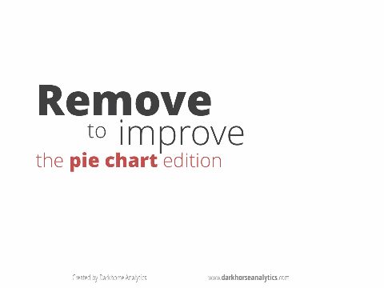

```{r setup, include=FALSE}
knitr::opts_chunk$set(echo = FALSE)
```


## Visualisation ?
<link href="https://fonts.googleapis.com/css?family=Armata&display=swap" rel="stylesheet">
“Transformation of the symbolic into the geometric”</br>
[McCormick et al. 1987]

“... finding the artificial memory that best supports our
natural means of perception.” </br>
[Bertin 1967]

“The use of computer-generated, interactive, visual
representations of data to amplify cognition.”</br>
[Card, Mackinlay, & Shneiderman 1999]


## Why visualize?
### Integrating the human in the loop
<ul>
<li>Answer questions or find questions? 
<li>Making decisions
<li>Putting data in context
<li>Amplify the memory
<li>Graphic calculation
<li>Find schematics and patterns
<li>Presenting arguments
</ul>

## Why visualize?

### Analyze :
<ul>
<li>Developing and criticizing hypotheses
<li>Discovering errors
<li>Find patterns
</ul>

### Communicate
<ul>
<li>Sharing and convincing
<li>Collaborate and review
</ul>

## <span class="red">Anscombe quartet</span>
```{r,warning=FALSE,message=FALSE}
library(dplyr)
library(knitr)
dd=data.frame(x=NULL,y=NULL,g=NULL)
for(i in 1:4){
dd=rbind(dd,data.frame(x=anscombe[,i],y=anscombe[,i+4],g=i))
}
kable(dd %>% group_by(g) %>% summarise(mean_x=mean(x),mean_y=mean(y),sd_x=sd(x),sd_y=sd(y)))
```


## <span class="red">Anscombe quartet</span> {data-background=#ffffff}
```{r,echo=FALSE,warning=FALSE,message=FALSE}
library(ggplot2)
dd=data.frame(x=NULL,y=NULL,g=NULL)
for(i in 1:4){
dd=rbind(dd,data.frame(x=anscombe[,i],y=anscombe[,i+4],g=i))
}
ggplot(dd,aes(x=x,y=y,color=factor(g)))+geom_point()+geom_smooth(method='lm',se=FALSE,fullrange=TRUE,size=0.7,alpha=0.7)+facet_wrap(~g)
```


## Cholera map (John Snow)
</img>


## 
<h1 ><span class="green"> Visualization </span><h1><h1>=</h1>
<h1>encode the data using </h1><h1> <span class="red">visual chanels </span></h1>


## <span class="red">Visual channels</span> {data-background=#ffffff}

<h4 class="orange" style="text-align:center"> Bertin Jacques, Sémiologie graphique, Paris, Mouton/Gauthier-Villars, 1967.</h4>


## <span class="red">Visual channels</span> {data-background=#ffffff}

<h4 class="orange" style="text-align:center"> Bertin Jacques, Sémiologie graphique, Paris, Mouton/Gauthier-Villars, 1967.</h4>

## Marks // visuals channels

### Marks :
graphical building blocks
</img>

### Visual channels :
The visual properties that varie

## <span class="red">Marks, visual channels </span> {data-background=#ffffff}


## <span class="red">Marks, visual channels </span> {data-background=#ffffff}

All channels are not equals

## <span class="red">Marks, visual channels </span> {data-background=#ffffff}
<h4><span class="red">The best channels depend on the feature type (continuous, categorical, ordinal,...)</span></h4>


## <span class="red">Marks, visual channels </span> {data-background=#ffffff}

<p style="color:black">The interesting part is not already available</p>

## pre-attentive processing
### How many 3 ?
1281768756138976546984506985604982826762
9809858458224509856458945098450980943585
9091030209905959595772564675050678904567
8845789809821677654876364908560912949686


## pre-attentive processing
### How many 3 ?
12817687561<span style="color:#ff0000">3</span>8976546984506985604982826762
980985845822450985645894509845098094<span style="color:#ff0000">3</span>585
90910<span style="color:#ff0000">3</span>0209905959595772564675050678904567
8845789809821677654876<span style="color:#ff0000">3</span>64908560912949686


## <span class="red">pre-attentive processing</span> {data-background=#ffffff}
</img>

## <span class="red">pre-attentive processing</span> {data-background=#ffffff}
</img>


## <span class="red">pre-attentive processing</span> {data-background=#ffffff}
</img>


## {data-background=#ffffff}
 


## {data-background=#ffffff}


## {data-background=#ffffff}


## 
```{r, echo=TRUE}
library(ggplot2)
ggplot(mpg)+geom_point(aes(x=cty,y=hwy,color=class))
```

##
<h1> Questions ? Features types  ?</h1><h1> <span class="blue">continuous ?</span> <span class="green">discretes ?</span> <span class="red">ordinals ?</span> <span class="purple">temporal ?</span> <span class="orange">spatials ?</span></h1><h1></h1>


##
<h1> <span class="green">Some categories</span> <h1><h1>and</h1><h1> <span class="red"> one quantity for each modality</span> </h1>


##
<h1 class="green"> The bar chart</h1>


## <span class="green"> le bar chart</span>
```{r, echo=TRUE, message=FALSE}
library(rjson)
library(dplyr)
?mpg
```


<h4> dataset mpg </h4>
<ul>

<li>manufacturer.

<li>model.

<li>displ. engine displacement, in litres

<li>...
</ul>

## <span class="green"> The bar chart</span>
```{r, echo=TRUE, message=FALSE,fig.height=4}
m_cty = mpg %>% group_by(manufacturer) %>% summarize(mcty=mean(cty))
ggplot(data=m_cty)+
  geom_bar(aes(x=manufacturer,y=mcty),stat = 'identity')+
  scale_x_discrete("Manufacturer")+
  scale_y_continuous("Miles / Gallon (City conditions)")
```


## <span class="green"> Order ?</span>
```{r, echo=TRUE, message=FALSE,fig.height=4}
m_cty_ordered = m_cty %>% arrange(desc(mcty)) %>% 
  mutate(manufacturer=factor(manufacturer,levels=manufacturer))
ggplot(data=m_cty_ordered)+
  geom_bar(aes(x=manufacturer,y=mcty),stat = 'identity')+
  scale_x_discrete("Manufacturer")+
  scale_y_continuous("Miles / Gallon (City conditions)")
```

## <span class="green"> Horizontal ?</span>
```{r, echo=TRUE, message=FALSE,fig.height=4}
ggplot(data=m_cty_ordered)+
  geom_bar(aes(x=manufacturer,y=mcty),stat = 'identity')+
  scale_x_discrete("Manufacturer")+
  scale_y_continuous("Miles / Gallon (City conditions)")+
  coord_flip()
```

##
<h1> The ligne : </h1>
<h1> <span class="green"> 1 numeric variable </span></h1> <h1>with respect</h1><h1> <span class="purple"> to time</span></h1>

##
<h1>Vélib' data :</h1>
```{r, echo=TRUE, message=FALSE,fig.height=5}
url="./data/sp_Lyon.json"
library(dplyr)
# read some data
data=fromJSON(file=url)
# to data.frame
extract = function(x){
  data.frame(id=x$'_id',
             time= x$download_date,
             nbbikes = x$available_bikes )
  }
st_tempstats.df=do.call(rbind,lapply(data,extract))
tempstats.df=st_tempstats.df |> group_by(time) |> summarise(nbbikes = sum(nbbikes))
```

## Time, natural order
```{r, echo=TRUE, message=FALSE,fig.height=5}
ggplot(data=tempstats.df,aes(x=time,y=nbbikes))+geom_point()
```

## Time, natural order
```{r, echo=TRUE, message=FALSE,fig.height=5}
ggplot(data=tempstats.df,aes(x=time,y=nbbikes))+geom_line()
```

## Aspect ratio
```{r, echo=TRUE, message=FALSE,fig.height=5,fig.width=10}
ggplot(data=tempstats.df,aes(x=time,y=nbbikes))+geom_line()
```

## Aspect ratio
```{r, echo=TRUE, message=FALSE,fig.height=5,fig.width=7}
ggplot(data=tempstats.df,aes(x=time,y=nbbikes))+geom_line()
```

## Aspect ratio
```{r, echo=TRUE, message=FALSE,fig.height=5,fig.width=4}
ggplot(data=tempstats.df,aes(x=time,y=nbbikes))+geom_line()
```

## Aspect ratio, 45°
Heuristic: use the aspect ratio that results in an average line slope of 45°.

<h4 class="orange" style="text-align:center">Cleveland, William S., Marylyn E. McGill, and Robert McGill. "The shape parameter of a two-variable graph." Journal of the American Statistical Association 83.402 (1988): 289-300.</h4>

## Area + Scale
```{r, echo=TRUE, message=FALSE,fig.height=5,fig.width=9}
ggplot(data=tempstats.df,aes(x=time,y=nbbikes))+geom_area()
```

## Point of view
```{r, echo=TRUE, message=FALSE,fig.height=5,fig.width=9}
ggplot(data=tempstats.df,aes(x=time,y=max(nbbikes)-nbbikes))+
  geom_area()
```

##
<h1> <span class="green"> 1 numeric variable</span></h1> <h1>with respect </h1><h1 ><span class="purple"> to time</span></h1><h1> <span class="purple"> + categories</span></h1>

## Velib data per stations
```{r, echo=TRUE, message=FALSE,fig.height=5}
# read data and pre-processing
url = "./data/sp_Lyon.json"
data=fromJSON(file=url)
extract = function(x){
  data.frame(id=x$'_id',
             time= x$download_date,
             nbbikes = x$available_bikes )
  }
st_tempstats.df=do.call(rbind,lapply(data,extract))
sel = st_tempstats.df %>% select(id) %>% unique() %>% sample_n(8) %>% pull()
# selection de quelques stations
st_tempstats_sub.df = st_tempstats.df %>% 
  filter(id %in% sel)
```

## Multiple line charts
```{r, echo=TRUE, message=FALSE,fig.height=5,fig.width=8}
ggplot(data=st_tempstats_sub.df)+
  geom_line(aes(x=time,y=nbbikes,group=id,color=factor(id)),size=2)
```

## Small multiples
```{r, echo=TRUE, message=FALSE,fig.height=5,fig.width=8}
ggplot(data=st_tempstats_sub.df)+
  geom_line(aes(x=time,y=nbbikes,group=id,color=factor(id)),size=2)+
  facet_grid(id ~ .)
```


##
<h1> <span class="red"> 2 numeric features </span></h1><h1 ><span class="green"> + categories</span> </h1>

## Scatter plot + colors
```{r, echo=TRUE, message=FALSE,fig.height=5}
mpg_su = mpg %>% 
  filter(class %in% c('compact','suv','pickup','minivan')) 
ggplot(mpg_su)+geom_point(aes(x=cty,y=hwy,color=class))
```

## Scatter plot + symbols
```{r, echo=TRUE, message=FALSE,fig.height=5}
mpg_su = mpg %>% 
  filter(class %in% c('compact','suv','pickup','minivan')) 
ggplot(mpg_su)+geom_point(aes(x=cty,y=hwy,shape=class))
```

##
<h1> <span class="red"> 3  numeric features (with one >0)</span></h1><h1 ><span class="green"> + categories</span> </h1>


## Scatter plot + color + size
```{r, echo=TRUE, message=FALSE,fig.height=5}
ggplot(mpg_su)+geom_point(aes(x=cty,y=hwy,color=class,size=displ))
```

## Scatter plot + color + size ! scales
```{r, echo=TRUE, message=FALSE,fig.height=5}
ggplot(mpg_su)+geom_point(aes(x=cty,y=hwy,color=class,size=displ))
```

##
<h1> Circle size : radius or area ?</h1>
<script src="./libs/d3.v3.min.js"></script>

<h4> Rayon </h4>
<svg id="g1" width="500px" height="150px">
</svg>
<script>
var svg = d3.select("#g1")
svg.selectAll("circle").data([5, 25, 50]).enter().append("circle").attr("cx",function(d,i){return 20+i*100}).attr("cy",52).attr("r",function(d){return d}).style("fill","#2ca02c").style("stroke","#165016").style("stroke-width","2px")
svg.selectAll("text").data([5, 25, 50]).enter().append("text").attr("x",function(d,i){return 20+i*100}).attr("y",125).text(function(d){return d})
</script>
<h4> Aire </h4>

<svg id="g2" width="500px" height="150px">
</svg>
<script>
var svg = d3.select("#g2")
svg.selectAll("circle").data([5, 25, 50]).enter().append("circle").attr("cx",function(d,i){return 20+i*100}).attr("cy",52).attr("r",function(d){return Math.sqrt(d)*3}).style("fill","#2ca02c").style("stroke","#165016").style("stroke-width","2px")
svg.selectAll("text").data([5, 25, 50]).enter().append("text").attr("x",function(d,i){return 20+i*100}).attr("y",125).text(function(d){return d})
</script>


## 
<h1> More complex graphics</h1>
https://www.data-to-viz.com/

ex: More than 3 continuous variables ?


## 
<h1> More complex graphics</h1>
https://www.data-to-viz.com/

ex: More than 3 continuous variables ?


## 
<h1> More complex graphics</h1>
https://www.data-to-viz.com/

ex: Multimodal distributions ?

##
<h1>Principle :</h1>


$$\textrm{Lie factor} = \frac{\textrm{visual effect size}}{\textrm{data effect size}}$$


##
<h1 class="red">Lie factor :</h1>
$$\textrm{data effect size} = \frac{27.5 - 18}{18} \times 100 = 53 \%$$

<h4 class="orange" style="text-align:center">Edward Tufte, The Visual Display of Quantitative Information, Cheshire, CT, Graphics Press, 2001, 2e éd. (1re éd. 1983)</h4>


##
<h1 class="red">Lie factor :</h1>
$$\textrm{visual effect size} = \frac{5.3 -0.6}{0.6} \times 100 = 783 \%$$

<h4 class="orange" style="text-align:center">Edward Tufte, The Visual Display of Quantitative Information, Cheshire, CT, Graphics Press, 2001, 2e éd. (1re éd. 1983)</h4>


##
<h1 class="red">Lie factor :</h1>
$$\textrm{Lie factor} = \frac{783}{53} = 14.8$$

<h4 class="orange" style="text-align:center">Edward Tufte, The Visual Display of Quantitative Information, Cheshire, CT, Graphics Press, 2001, 2e éd. (1re éd. 1983)</h4>


##
<h1 class="red">Lie factor : 9.4</h1>

<h4 class="orange" style="text-align:center">Edward Tufte, The Visual Display of Quantitative Information, Cheshire, CT, Graphics Press, 2001, 2e éd. (1re éd. 1983)</h4>

##

<p>knowing that the "apple"" area (in green ) is equal to $2.22\,cm^2$ and that the rim area (in blue) is equal to
$2.96\,cm^2$ compute the lyong factor ?</p>


## Perception
</img>
$$S = I^p$$


##
<h1>Principle :</h1>
<h1 class="green">Increase the data density</h1>
$$\textrm{graph data density} = \frac{\textrm{number of entries in data matrix}}{\textrm{area of data display}} $$

##
<h1 class="red">Data density :</h1>
<h4>Avoid graphics with low data density</h4>

<h4 class="orange" style="text-align:center">Edward Tufte, The Visual Display of Quantitative Information, Cheshire, CT, Graphics Press, 2001, 2e éd. (1re éd. 1983)</h4>


##
<h1 class="red">Data density :</h1>
<h4>Avoid graphics with low data density</h4>

<h4 class="orange" style="text-align:center">Edward Tufte, The Visual Display of Quantitative Information, Cheshire, CT, Graphics Press, 2001, 2e éd. (1re éd. 1983)</h4>

##
<h1>Principle :</h1>
<h1 class="green">Increase the data-ink ratio</h1>
$$\textrm{data-ink ratio} = \frac{\textrm{area of data-ink}}{\textrm{total area of ink}}$$


##
<h1 class="red">Data-ink ratio :</h1>
</img>


##
<h1 class="red">Data-ink ratio :</h1>
<a href="https://speakerdeck.com/cherdarchuk/remove-to-improve-the-data-ink-ratio"><h4>Remove to improve</h4></a>

<a href="https://speakerdeck.com/cherdarchuk/remove-to-improve-the-data-ink-ratio">https://speakerdeck.com/cherdarchuk/remove-to-improve-the-data-ink-ratio</a>

##
<h1 class="red">Data-ink ratio :</h1>
<a href="https://www.youtube.com/watch?v=bDbJBWvonVI"><h4>Remove to improve</h4></a>
<a href="https://www.youtube.com/watch?v=bDbJBWvonVI">https://www.youtube.com/watch?v=bDbJBWvonVI</a>


## Recap
<ul>
<li> Avoid misleading graphics !
<li> Avoid empty graphics
<li> Be parsimonius with ink
<li> Scales !, (!colors, !size) 
<li> Use explicit labels and 
<li> ! categorial features and order
<li> aspect ratio
<li> filetype pdf, svg // png,jpg
</ul>


## <span class="green">ggplot</span>
<h1> gg = <span class="red"> grammar of graphics </span></h1> 
<ul>
<li> "The Grammar of Graphics" (Wilkinson, Annand and Grossman, 2005)
<li> grammar &#8594; same language for all figures 
</ul>


## ggplot


<h4>building blocks of  the grammar</h4>
<ul>
<li> <span class="red">the coordinate system</span>
<li> <span class="red">data and aesthetic mappings</span>,<br>
ex : f(data) &#8594; x position, y position, size, shape, color 
<li> <span class="red">geometric objects</span>,<br>
ex : points, lines, bars, texts 
<li> <span class="red">scales</span>,<br>
ex : f([0, 100]) &#8594; [0, 5] px
<li> <span class="red">facet specification</span>,<br>
ex : split the data into several plots
<li><span class="red">statistical transformations</span>,<br> 
ex : average, coounting, regression
</ul>
</section>


## ggplot
<h4>Make a graphic :</h4>
<ul>
<li> add several layers 
<li> with their own visual encoding and possibly their own data
<li> (+ optionel) add statistical transformation
<li> (+ optionel) change scale options
<li> (+ optionel) specify title, theme, guides, style ...
</ul>
<br><br>
<h4 class="red">! data = tidy data.frame with the right feature types</h4>


## <span class="green">ggplot, géométries</span>
<h4>Make a graphic :</h4>
<ul>
<li> add several layers 
<pre><code class="r">+geom_line()</pre></code>
<li> with their own visual encoding and possibly their own data
<pre><code class="r">aes(x=a,y=b,...)</pre></code>
</ul>
<h4>Exemple</h4>
<pre><code class="r">
ggplot(mpg)+
  geom_point(aes(x=cty,y=hwy,color=manufacturer,shape=factor(cyl)))
ggplot(mpg,aes(x=cty,y=hwy,color=manufacturer,shape=factor(cyl)))+
  geom_jitter()
</pre></code>


## ggplot
```{r, echo=TRUE, message=FALSE,fig.height=4}
ggplot(mpg,aes(x=cty,y=hwy,color=class))+geom_point()
```

## ggplot
```{r, echo=TRUE, message=FALSE,fig.height=4}
ggplot(mpg,aes(x=cty,y=hwy,color=class))+geom_jitter()
```


## ggplot
```{r, echo=TRUE, message=FALSE,fig.height=4}
ggplot(mpg,aes(x=cty,fill=class))+geom_histogram(binwidth=2)
```

## ggplot
```{r, echo=TRUE, message=FALSE,fig.height=4}
ggplot(mpg,aes(y=cty,x=class))+geom_violin()
```


## <span class="green">ggplot, scales</span>
<h4>Make a graphic :</h4>
<ul>
<li> add several layers 
<pre><code class="r">+geom_line()</pre></code>
<li> with their own visual encoding and possibly their own data
<pre><code class="r">aes(x=a,y=b,...)</pre></code>
<li> (+ optionel) change scale options
<pre><code class="r">scale_fill_brewer(palette=3,type="qual")
scale_x_continuous(limits=c(0,45),breaks=seq(0,45,2))</pre></code>
</ul>


## <span class="green">ggplot, scales</span>
```{r, echo=TRUE, message=FALSE,fig.height=4}
ggplot(mpg,aes(x=cty,y=hwy,color=manufacturer,shape=factor(cyl)))+
  geom_jitter()+
  scale_x_continuous(limits=c(0,45),breaks=seq(0,45,2))
```


##
<h1><span class="green">Colors</span> <br><span class="orange"></span><br> <span class="purple">scales</span></h1>


## Color scales
<a href="http://colorbrewer2.org/"><h1>http://colorbrewer2.org/</h1></a>


## <span class="green">ggplot, faceting</span>
<h4>Make a graphic :</h4>
<ul>
<li> add several layers 
<pre><code class="r">+geom_line()</pre></code>
<li> with their own visual encoding and possibly their own data
<pre><code class="r">aes(x=a,y=b,...)</pre></code>
<li> (+ optionel) change scale options
<pre><code class="r">scale_fill_brewer(palette=3,type="qual")
scale_x_continuous(limits=c(0,45),breaks=seq(0,45,2))</pre></code>
<li> use facet ?
<pre><code class="r">facet_grid(. ~ cyl)</pre></code>
</ul>

## <span class="green">ggplot, faceting</span>
```{r, echo=TRUE, message=FALSE,fig.height=5}
ggplot(data=mpg,aes(x=hwy,y=cty,color=class))+
  geom_point()+
  facet_wrap(~year)
```

## <span class="green">ggplot, stats</span>
<h4>Make a graphic :</h4>
<ul>
<li> add several layers 
<pre><code class="r">+geom_line()</pre></code>
<li> with their own visual encoding and possibly their own data
<pre><code class="r">aes(x=a,y=b,...)</pre></code>
<li> (+ optionel) change scale options
<pre><code class="r">scale_fill_brewer(palette=3,type="qual")
scale_x_continuous(limits=c(0,45),breaks=seq(0,45,2))</pre></code>
<li> add statistics
<pre><code class="r">stat_density2d()</pre></code>
</ul>


## ggplot
```{r, echo=TRUE, message=FALSE,fig.height=4}
ggplot(mpg,aes(y=cty,x=hwy))+
  geom_point(color="blue")+stat_density2d()
```

## ggplot
```{r, echo=TRUE, message=FALSE,fig.height=4}
ggplot(mpg,aes(y=cty,x=hwy))+
  geom_point(color="blue")+stat_smooth()
```

## ggplot
```{r, echo=TRUE, message=FALSE,fig.height=4}
library(hexbin)
ggplot(mpg,aes(y=cty,x=hwy))+
  stat_binhex()
```


## Sources

<ul>
<li> https://github.com/rfordatascience/tidytuesday
<li> https://www.r-graph-gallery.com/index.html
<li> http://www.cis.umassd.edu/~dkoop/cis467
<li> https://www.namwkim.org/datavis
<li> https://courses.cs.washington.edu/courses/cse512
<li> https://serialmentor.com/dataviz/
<li> http://socviz.co/gettingstarted.html
</ul>

## Exercises
Update the scale and labels
```{r, echo=TRUE, message=FALSE,fig.show='hide'}
# téléchargement et remise en forme des données
url = "./data/sp_Lyon.json"
data=fromJSON(file=url)
extract = function(x){
  data.frame(id=x$'_id',
             time= x$download_date,
             nbbikes = x$available_bikes )
  }
st_tempstats.df=do.call(rbind,lapply(data,extract))
# selection de 3 stations
st_tempstats_sub.df = st_tempstats.df %>% 
  filter(id %in% sel)
ggplot(data=st_tempstats_sub.df)+
  geom_line(aes(x=time,y=nbbikes,group=id,color=factor(id)),size=2)+
  facet_grid(id ~ .)
```

## Exercises
Update the scale and labels
```{r, echo=FALSE, message=FALSE,fig.height=4}
ggplot(data=st_tempstats_sub.df)+
  geom_line(aes(x=time,y=nbbikes,group=id,color=factor(id)),size=2)+
  facet_grid(id ~ .)
```


## Exercises
Reproduce this graphic (Iris data)
```{r, echo=FALSE, message=FALSE,fig.height=4}
ggplot(data=iris,aes(x=Petal.Length,y=Petal.Width,color=Species,shape=Species))+geom_point()+geom_density2d()
```

## Exercices
Reproduce this graphic (mtcars data)
! modifier le theme du graphique ?theme
```{r, echo=FALSE, message=FALSE,fig.height=4}
mto = mtcars %>% mutate(label = rownames(mtcars)) %>% arrange(mpg)  %>% mutate(label=factor(label,levels=label))
ggplot(data=mto,aes(y=label,x=mpg))+geom_point()+geom_text(aes(y=label,x=mpg+1,label=label),hjust= "left")+theme_bw()+scale_x_continuous(limits=c(10,50),"Miles / Gallon")+scale_y_discrete("")+theme(axis.title.y = element_blank(), axis.text.y = element_blank(),line = element_blank(),rect=element_blank(),axis.line.x = element_line(),axis.ticks.x.bottom = element_line())
```

## Exercises
Reproduce this graphic
```{r, echo=FALSE, message=FALSE,fig.height=5}
library(tidyr)
# téléchargement et remise en forme des données
url = "./data/sp_Lyon.json"
data=fromJSON(file=url)
extract = function(x){
  data.frame(id=x$'_id',
             time= x$download_date,
             nbbikes = x$available_bikes )
  }
st_tempstats.df=do.call(rbind,lapply(data,extract))
# taille des stations
st_size.df = st_tempstats.df %>% group_by(id) %>% summarise(size=max(nbbikes))
# ratio de remplissage
st_fillratio.df = st_tempstats.df %>% left_join(st_size.df) %>% mutate(fillratio = nbbikes/size) %>% select(id,time,fillratio)
# passage en large
X = st_fillratio.df%>% spread(time,fillratio,fill = 0)
# kmeans
Xnum=X[,2:ncol(X)]
K=8
clust= kmeans(Xnum,K)
clust.df  = data.frame(id=X[,1],cluster=factor(clust$cluster,levels=1:K))
res.df = st_fillratio.df %>% left_join(clust.df) %>% mutate(fillratio=ifelse(is.na(fillratio),0,fillratio))
res.mean.df = res.df %>% group_by(time,cluster) %>% summarise(mfillratio=mean(fillratio))
ggplot()+geom_line(data=res.df,aes(x=as.POSIXct(time,origin="1970-01-01"),y=fillratio,color=cluster,group=id),alpha=0.05)+
  geom_line(data=res.mean.df,aes(x=as.POSIXct(time,origin="1970-01-01"),y=mfillratio,color=cluster,group=cluster),size=1.5)+
  facet_grid(cluster~.)+scale_x_datetime("")+scale_y_continuous("Fill / Ratio")
```

## Exercises
Reproduce this graphic
Informations :
<ul>
<li> Bike sharing data from lyon (data folder)
<li> Compute the occupancy rate nb bikes / max(nb bikes)
<li> pivot to wide
<li> do a k-means with 8 clusters X (rows = stations, column = time slot)
<li> facet + mean curve + alpha blending
</ul>


