```{r setup, include=FALSE}
knitr::opts_chunk$set(echo = FALSE)
```


## Visualisation ?
<link href="https://fonts.googleapis.com/css?family=Armata&display=swap" rel="stylesheet">
“Transformation of the symbolic into the geometric”</br>
[McCormick et al. 1987]

“... finding the artificial memory that best supports our
natural means of perception.” </br>
[Bertin 1967]

“The use of computer-generated, interactive, visual
representations of data to amplify cognition.”</br>
[Card, Mackinlay, & Shneiderman 1999]


## Pourquoi visualiser ?
### Intégrer l'humain dans la boucle
<ul>
<li> Répondre a des questions ou trouver des questions ? 
<li> Prendre des décisions
<li> Remettre les données dans leur contexte
<li> Amplifier la mémoire
<li> Calcul graphique
<li> Trouver des schémas, des patterns
<li> Présenter des arguments
<li> Inspirer
</ul>

## Pourquoi visualiser ?

### Analyser :
<ul>
<li> Développer et critiquer des hypothèses
<li> Découvrir des erreurs
<li> Trouver des patterns
</ul>

### Communiquer
<ul>
<li> Partager et convaincre
<li> Collaborer et réviser
</ul>

## <span class="red">Anscombe quartet</span>
```{r,warning=FALSE,message=FALSE}
library(dplyr)
library(knitr)
dd=data.frame(x=NULL,y=NULL,g=NULL)
for(i in 1:4){
dd=rbind(dd,data.frame(x=anscombe[,i],y=anscombe[,i+4],g=i))
}
kable(dd %>% group_by(g) %>% summarise(mean_x=mean(x),mean_y=mean(y),sd_x=sd(x),sd_y=sd(y)))
```


## <span class="red">Anscombe quartet</span> {data-background=#ffffff}
```{r,echo=FALSE,warning=FALSE,message=FALSE}
library(ggplot2)
dd=data.frame(x=NULL,y=NULL,g=NULL)
for(i in 1:4){
dd=rbind(dd,data.frame(x=anscombe[,i],y=anscombe[,i+4],g=i))
}
ggplot(dd,aes(x=x,y=y,color=factor(g)))+geom_point()+geom_smooth(method='lm',se=FALSE,fullrange=TRUE,size=0.7,alpha=0.7)+facet_wrap(~g)
```


## Cholera map (John Snow)
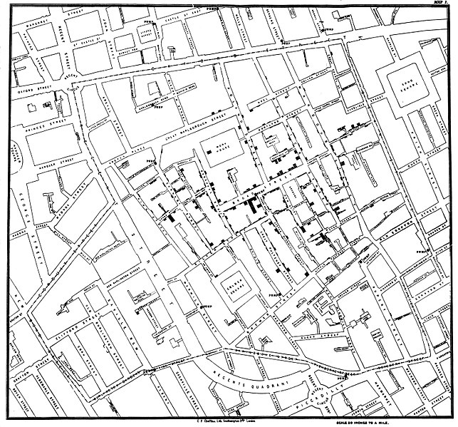</img>


## 
<h1 ><span class="green"> Visualiser </span><h1><h1>=</h1><h1>encoder dans des </h1><h1> <span class="red"> variables graphiques</span></h1><h1> les données</h1>


## <span class="red">Variables graphiques</span> {data-background=#ffffff}

<h4 class="orange" style="text-align:center"> Bertin Jacques, Sémiologie graphique, Paris, Mouton/Gauthier-Villars, 1967.</h4>


## <span class="red">Variables graphiques</span> {data-background=#ffffff}

<h4 class="orange" style="text-align:center"> Bertin Jacques, Sémiologie graphique, Paris, Mouton/Gauthier-Villars, 1967.</h4>

## Marques // variables graphiques

### Marques :
Eléments de base du graphiques
</img>

### Variables graphique (chanels) :
Ce qui va varier en fonctions des données

## <span class="red">Variables graphiques, marques </span> {data-background=#ffffff}
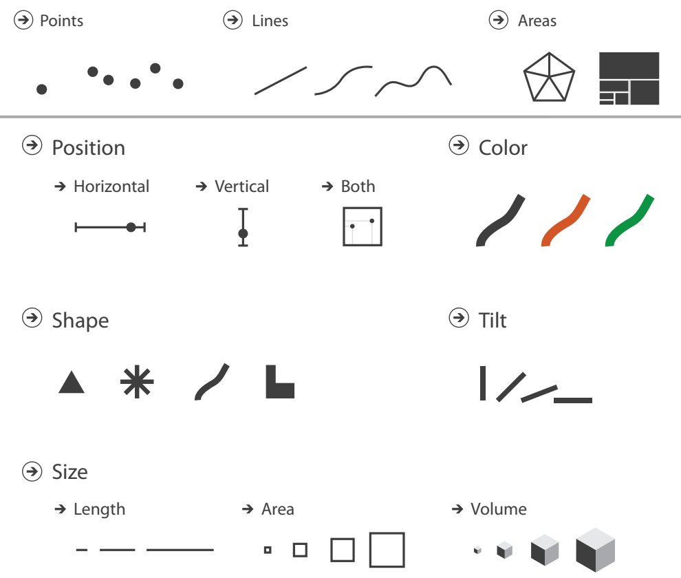


## <span class="red">Variables graphiques, marques </span> {data-background=#ffffff}
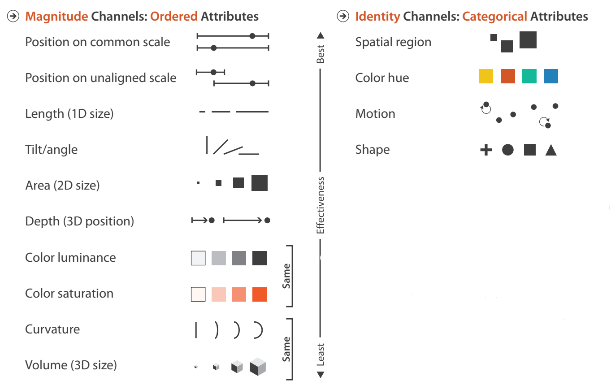
Toutes les variables graphiques ne se valent pas.

## <span class="red">Variables graphiques, marques </span> {data-background=#ffffff}
<h4><span class="red">Choisir une variable graphique adapté aux type de la variable représenté</span></h4>
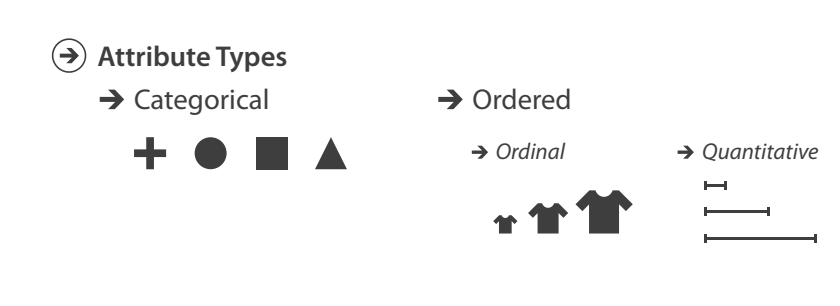

## <span class="red">Variables graphiques, marques </span> {data-background=#ffffff}
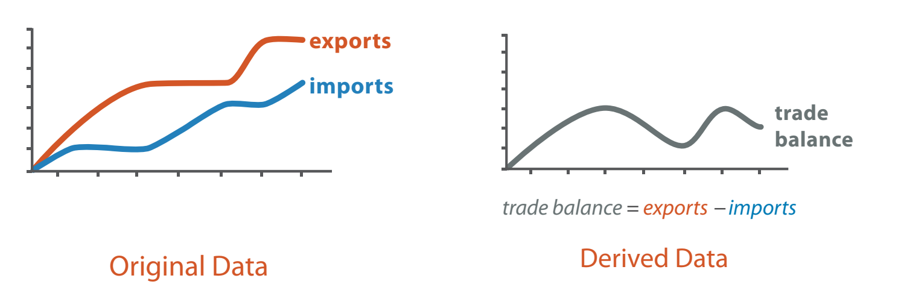
<p style="color:black">Ce qui est intéressant n'est pas toujours ce que l'on a au départ.</p>

## pré-attentive processing
### Combien de 3 ?
1281768756138976546984506985604982826762
9809858458224509856458945098450980943585
9091030209905959595772564675050678904567
8845789809821677654876364908560912949686


## pré-attentive processing
### Combien de 3 ?
12817687561<span style="color:#ff0000">3</span>8976546984506985604982826762
980985845822450985645894509845098094<span style="color:#ff0000">3</span>585
90910<span style="color:#ff0000">3</span>0209905959595772564675050678904567
8845789809821677654876<span style="color:#ff0000">3</span>64908560912949686


## <span class="red">pré-attentive processing</span> {data-background=#ffffff}
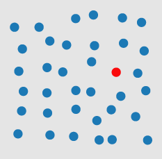</img>

## <span class="red">pré-attentive processing</span> {data-background=#ffffff}
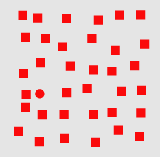</img>


## <span class="red">pré-attentive processing</span> {data-background=#ffffff}
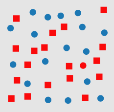</img>


## {data-background=#ffffff}
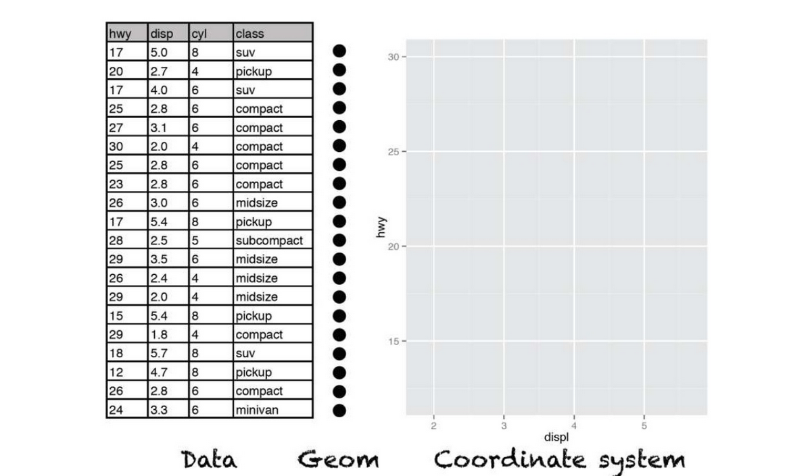 


## {data-background=#ffffff}
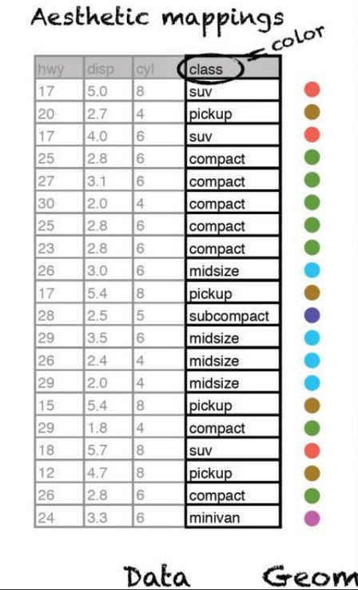


## {data-background=#ffffff}
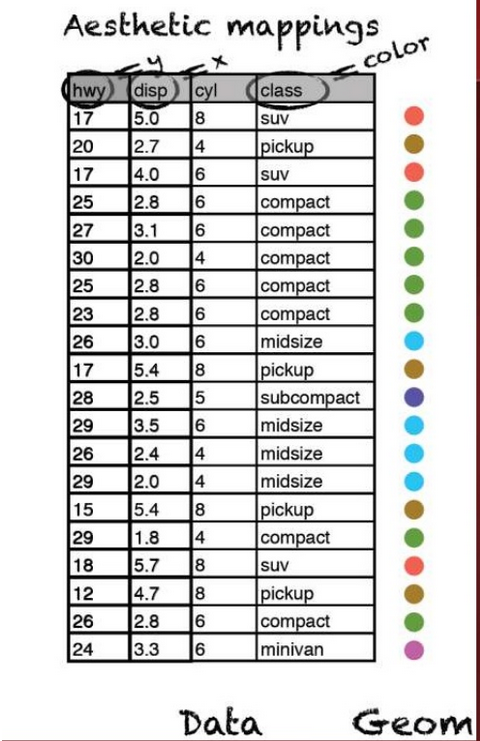


## 
```{r, echo=TRUE}
library(ggplot2)
ggplot(mpg)+geom_point(aes(x=cty,y=hwy,color=class))
```

##
<h1> Questions ? type des variables ?</h1><h1> <span class="blue">continues ?</span> <span class="green">discrètes ?</span> <span class="red">ordonnées ?</span> <span class="purple">temporelles ?</span> <span class="orange">spatiales ?</span></h1><h1></h1>


##
<h1> <span class="green">Des catégories</span> <h1><h1>et</h1><h1> <span class="red"> une quantité pour chaque catégorie</span> </h1>


##
<h1 class="green"> le bar chart</h1>


## <span class="green"> le bar chart</span>
```{r, echo=TRUE, message=FALSE}
library(rjson)
library(dplyr)
?mpg
```


<h4> dataset mpg </h4>
<ul>

<li>manufacturer.

<li>model.

<li>displ. engine displacement, in litres

<li>...
</ul>

## <span class="green"> le bar chart</span>
```{r, echo=TRUE, message=FALSE,fig.height=4}
m_cty = mpg %>% group_by(manufacturer) %>% summarize(mcty=mean(cty))
ggplot(data=m_cty)+
  geom_bar(aes(x=manufacturer,y=mcty),stat = 'identity')+
  scale_x_discrete("Manufacturer")+
  scale_y_continuous("Miles / Gallon (City conditions)")
```


## <span class="green"> Ordre ?</span>
```{r, echo=TRUE, message=FALSE,fig.height=4}
m_cty_ordered = m_cty %>% arrange(desc(mcty)) %>% 
  mutate(manufacturer=factor(manufacturer,levels=manufacturer))
ggplot(data=m_cty_ordered)+
  geom_bar(aes(x=manufacturer,y=mcty),stat = 'identity')+
  scale_x_discrete("Manufacturer")+
  scale_y_continuous("Miles / Gallon (City conditions)")
```

## <span class="green"> Horizontal ?</span>
```{r, echo=TRUE, message=FALSE,fig.height=4}
ggplot(data=m_cty_ordered)+
  geom_bar(aes(x=manufacturer,y=mcty),stat = 'identity')+
  scale_x_discrete("Manufacturer")+
  scale_y_continuous("Miles / Gallon (City conditions)")+
  coord_flip()
```

##
<h1> La ligne : </h1>
<h1> <span class="green"> 1 variable numérique</span></h1> <h1>en fonction du</h1><h1> <span class="purple"> temps</span></h1>

##
<h1>Données Vélib' aggrégées :</h1>
```{r, echo=TRUE, message=FALSE,fig.height=5}
url="http://vlsstats.ifsttar.fr/data/temporalstats_Velib2018.json"
# lecture des données
data=fromJSON(file=url)
# construction d'une liste de data.frame homogènes
tempstats.list=lapply(data,function(x){
  data.frame(time=x$'_id',nbbikes=x$value$total_available_bikes)})
# concatenations des data.frame ?do.call
tempstats.df=do.call(rbind,tempstats.list)
```

## Ordre naturel imposé par le temps
```{r, echo=TRUE, message=FALSE,fig.height=4}
ggplot(data=tempstats.df,aes(x=time,y=nbbikes))+geom_point()
```

## Ordre naturel imposé par le temps
```{r, echo=TRUE, message=FALSE,fig.height=4}
ggplot(data=tempstats.df,aes(x=time,y=nbbikes))+geom_line()
```

## Aspect ratio
```{r, echo=TRUE, message=FALSE,fig.height=5,fig.width=10}
ggplot(data=tempstats.df,aes(x=time,y=nbbikes))+geom_line()
```

## Aspect ratio
```{r, echo=TRUE, message=FALSE,fig.height=5,fig.width=7}
ggplot(data=tempstats.df,aes(x=time,y=nbbikes))+geom_line()
```

## Aspect ratio
```{r, echo=TRUE, message=FALSE,fig.height=5,fig.width=4}
ggplot(data=tempstats.df,aes(x=time,y=nbbikes))+geom_line()
```

## Aspect ratio, 45°
Heuristic: use the aspect ratio that results in an average line slope of 45°.
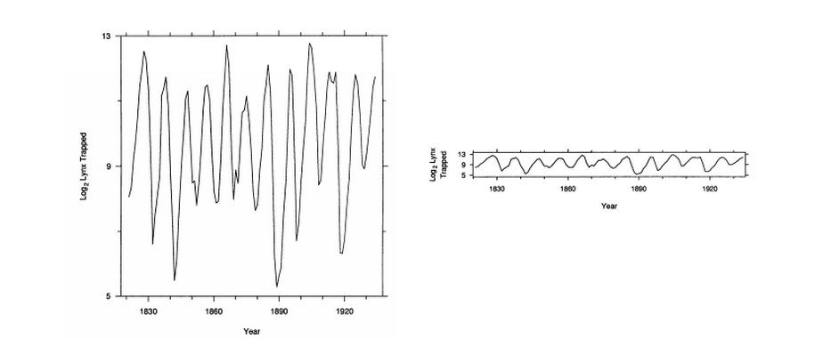
<h4 class="orange" style="text-align:center">Cleveland, William S., Marylyn E. McGill, and Robert McGill. "The shape parameter of a two-variable graph." Journal of the American Statistical Association 83.402 (1988): 289-300.</h4>

## Aire + Echelle
```{r, echo=TRUE, message=FALSE,fig.height=5,fig.width=9}
ggplot(data=tempstats.df,aes(x=time,y=nbbikes))+geom_area()
```

## Changement de point de vue
```{r, echo=TRUE, message=FALSE,fig.height=5,fig.width=9}
ggplot(data=tempstats.df,aes(x=time,y=max(nbbikes)-nbbikes))+
  geom_area()
```

##
<h1> <span class="green"> 1 variable numérique</span></h1> <h1>en fonction du</h1><h1 ><span class="purple"> temps</span></h1><h1> <span class="purple"> + catégories</span></h1>

## Données Vélib par stations
```{r, echo=TRUE, message=FALSE,fig.height=5}
# téléchargement et remise en forme des données
url = "./data/sp_Lyon.json"
data=fromJSON(file=url)
extract = function(x){
  data.frame(id=x$'_id',
             time= x$download_date,
             nbbikes = x$available_bikes )
  }
st_tempstats.df=do.call(rbind,lapply(data,extract))
sel = st_tempstats.df %>% select(id) %>% unique() %>% sample_n(8) %>% pull()
# selection de quelques stations
st_tempstats_sub.df = st_tempstats.df %>% 
  filter(id %in% sel)
```

## Line charts superposés
```{r, echo=TRUE, message=FALSE,fig.height=5,fig.width=8}
ggplot(data=st_tempstats_sub.df)+
  geom_line(aes(x=time,y=nbbikes,group=id,color=factor(id)),size=2)
```

## Small multiples
```{r, echo=TRUE, message=FALSE,fig.height=5,fig.width=8}
ggplot(data=st_tempstats_sub.df)+
  geom_line(aes(x=time,y=nbbikes,group=id,color=factor(id)),size=2)+
  facet_grid(id ~ .)
```


##
<h1> <span class="red"> 2 variables numériques</span></h1><h1 ><span class="green"> + catégories</span> </h1>

## Scatter plot + colors
```{r, echo=TRUE, message=FALSE,fig.height=5}
mpg_su = mpg %>% 
  filter(class %in% c('compact','suv','pickup','minivan')) 
ggplot(mpg_su)+geom_point(aes(x=cty,y=hwy,color=class))
```

## Scatter plot + symbols
```{r, echo=TRUE, message=FALSE,fig.height=5}
mpg_su = mpg %>% 
  filter(class %in% c('compact','suv','pickup','minivan')) 
ggplot(mpg_su)+geom_point(aes(x=cty,y=hwy,shape=class))
```

##
<h1> <span class="red"> 3 variables numériques (dont une >0)</span></h1><h1 ><span class="green"> + catégories</span> </h1>


## Scatter plot + couleur + taille
```{r, echo=TRUE, message=FALSE,fig.height=5}
ggplot(mpg_su)+geom_point(aes(x=cty,y=hwy,color=class,size=displ))
```

## Scatter plot + couleur + taille ! echelles
```{r, echo=TRUE, message=FALSE,fig.height=5}
ggplot(mpg_su)+geom_point(aes(x=cty,y=hwy,color=class,size=displ))
```

##
<h1> Taille des cercles : échelle aire ou rayon ?</h1>
<script src="./libs/d3.v3.min.js"></script>

<h4> Rayon </h4>
<svg id="g1" width="500px" height="150px">
</svg>
<script>
var svg = d3.select("#g1")
svg.selectAll("circle").data([5, 25, 50]).enter().append("circle").attr("cx",function(d,i){return 20+i*100}).attr("cy",52).attr("r",function(d){return d}).style("fill","#2ca02c").style("stroke","#165016").style("stroke-width","2px")
svg.selectAll("text").data([5, 25, 50]).enter().append("text").attr("x",function(d,i){return 20+i*100}).attr("y",125).text(function(d){return d}).attr("fill","#fff")
</script>
<h4> Aire </h4>

<svg id="g2" width="500px" height="150px">
</svg>
<script>
var svg = d3.select("#g2")
svg.selectAll("circle").data([5, 25, 50]).enter().append("circle").attr("cx",function(d,i){return 20+i*100}).attr("cy",52).attr("r",function(d){return Math.sqrt(d)*3}).style("fill","#2ca02c").style("stroke","#165016").style("stroke-width","2px")
svg.selectAll("text").data([5, 25, 50]).enter().append("text").attr("x",function(d,i){return 20+i*100}).attr("y",125).text(function(d){return d}).attr("fill","#fff")
</script>


## {data-background=#ffffff}


##
<h1>Principes :</h1>
<h1 class="red">Eviter de mentir,<br> Lie Factor</h1>

$$\textrm{Lie factor} = \frac{\textrm{visual effect size}}{\textrm{data effect size}}$$


##
<h1 class="red">Lie factor :</h1>
$$\textrm{data effect size} = \frac{27.5 - 18}{18} \times 100 = 53 \%$$
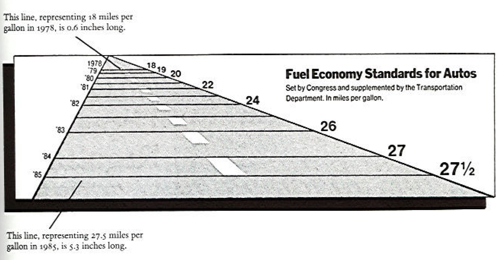
<h4 class="orange" style="text-align:center">Edward Tufte, The Visual Display of Quantitative Information, Cheshire, CT, Graphics Press, 2001, 2e éd. (1re éd. 1983)</h4>


##
<h1 class="red">Lie factor :</h1>
$$\textrm{visual effect size} = \frac{5.3 -0.6}{0.6} \times 100 = 783 \%$$

<h4 class="orange" style="text-align:center">Edward Tufte, The Visual Display of Quantitative Information, Cheshire, CT, Graphics Press, 2001, 2e éd. (1re éd. 1983)</h4>


##
<h1 class="red">Lie factor :</h1>
$$\textrm{Lie factor} = \frac{783}{53} = 14.8$$

<h4 class="orange" style="text-align:center">Edward Tufte, The Visual Display of Quantitative Information, Cheshire, CT, Graphics Press, 2001, 2e éd. (1re éd. 1983)</h4>


##
<h1 class="red">Lie factor : 9.4</h1>
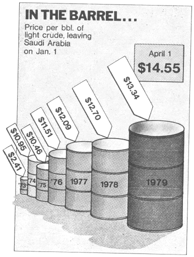
<h4 class="orange" style="text-align:center">Edward Tufte, The Visual Display of Quantitative Information, Cheshire, CT, Graphics Press, 2001, 2e éd. (1re éd. 1983)</h4>

##

<p>Sachant que l’aire de la tranche "apple"" (en vert) est proportionelle à $2.22\,cm^2$ et celle correspondant à rim (en bleue) est proportionelle à
$2.96\,cm^2$ calculer le lying factor ?</p>


## Perception
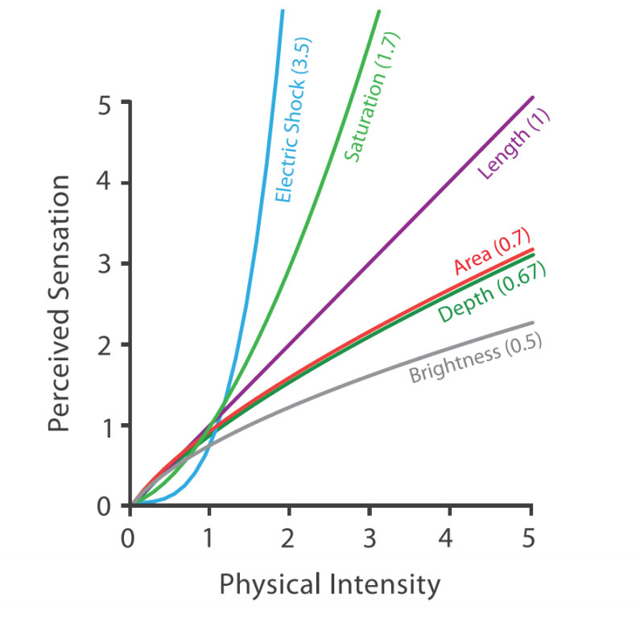</img>
$$S = I^p$$


##
<h1>Principes :</h1>
<h1 class="green">Augmenter la densité de données</h1>
$$\textrm{graph data density} = $$
$$\frac{\textrm{number of entries in data matrix}}{\textrm{area of data display}}$$
</section>

##
<h1 class="red">Data density :</h1>
<h4>Eviter les graphique à faible densité</h4>
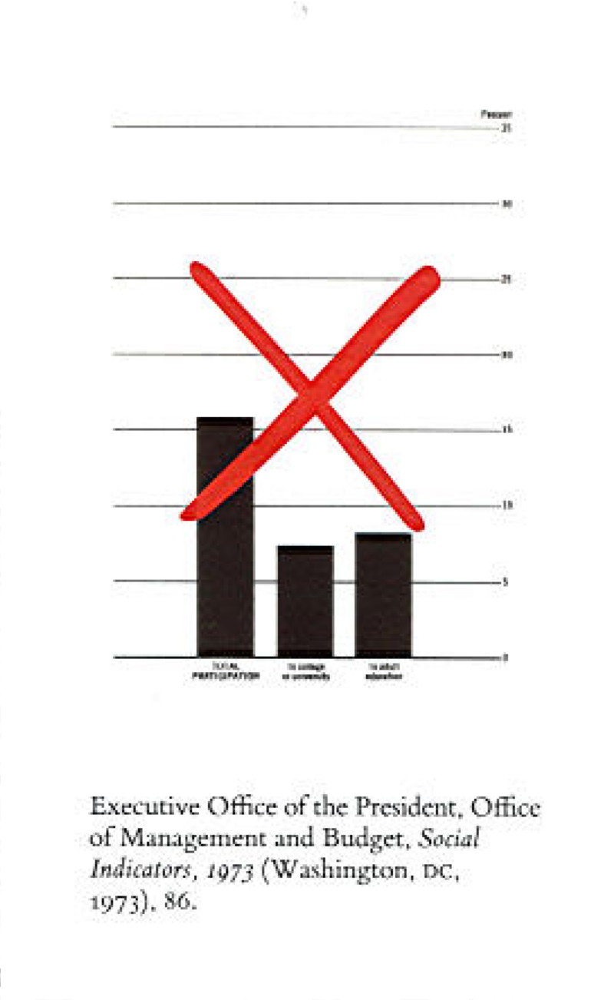
<h4 class="orange" style="text-align:center">Edward Tufte, The Visual Display of Quantitative Information, Cheshire, CT, Graphics Press, 2001, 2e éd. (1re éd. 1983)</h4>


##
<h1 class="red">Data density :</h1>
<h4>Meilleure densité de donnée</h4>
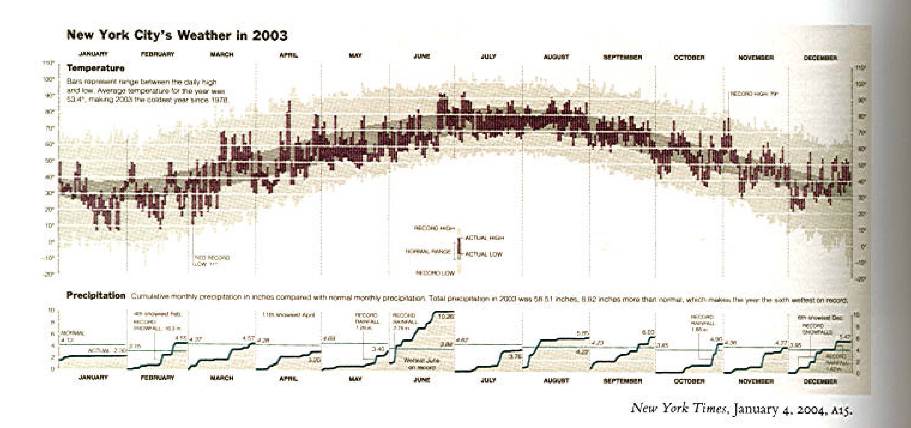
<h4 class="orange" style="text-align:center">Edward Tufte, The Visual Display of Quantitative Information, Cheshire, CT, Graphics Press, 2001, 2e éd. (1re éd. 1983)</h4>


##<span class="red">Bonnes pratiques :</span>
<ul>
<li> éviter de mentir !
<li> faire des graphiques riches
<li> avec des encodages adaptés
<li> de bonnes échelles, (!couleurs, !aires) 
<li> des axes labelisés
<li> ordre des facteurs
<li> aspect ratio
<li> format d'enregistrements pdf, svg // png,jpg
</ul>


## <span class="green">ggplot</span>
<h1> gg = <span class="red"> grammar of graphics </span></h1> 
<ul>
<li> "The Grammar of Graphics" (Wilkinson, Annand and Grossman, 2005)
<li> grammaire &#8594; même type de description pour des graphique différents 
</ul>


## ggplot


<h4>Composants de la grammaires :</h4>
</ul>
<li> <span class="red">data and aesthetic mappings</span>,<br>
ex : f(data) &#8594; x position, y position, size, shape, color 
<li> <span class="red">geometric objects</span>,<br>
ex : points, lines, bars, texts 
<li> <span class="red">scales</span>,<br>
ex : f([0, 100]) &#8594; [0, 5] px
<li> <span class="red">facet specification</span>,<br>
ex : segmentation des données suivant un ou plusieurs facteurs
<li> <span class="red">statistical transformations</span>,<br> 
ex : moyenne, comptage, régression
<li> <span class="red">the coordinate system</span>.
</ul>
</section>


## ggplot
<h4>Création d'un graphique :</h4>
</ul>
<li> ajout successif de layers (calques) 
<li> définissant un mapping des données vers leurs représentation
<li> (+ optionel) définition de transformations statistique 
<li> (+ optionel) définition des échelles
<li> (+ optionel) gestion du thème des titre ...
</ul>
<br><br>
<h4 class="red">! Données toujours sous forme de data.frame bien formatées</h4>


## <span class="green">ggplot, géométries</span>
<h4>Création d'un graphique :</h4>
</ul>
<li> ajout successif de layers (calques)<br>
<pre><code class="r">+geom_line()</pre></code>
<li> définissant un mapping des données vers leurs représentation
<pre><code class="r">aes(x=a,y=b,...)</pre></code>
</ul>
<h4>Exemple</h4>
<pre><code class="r">
ggplot(mpg)+
  geom_point(aes(x=cty,y=hwy,color=manufacturer,shape=factor(cyl)))
ggplot(mpg,aes(x=cty,y=hwy,color=manufacturer,shape=factor(cyl)))+
  geom_jitter()
</pre></code>


## ggplot
```{r, echo=TRUE, message=FALSE,fig.height=5}
ggplot(mpg,aes(x=cty,y=hwy,color=manufacturer))+geom_point()
```

## ggplot
```{r, echo=TRUE, message=FALSE,fig.height=5}
ggplot(mpg,aes(x=cty,y=hwy,color=manufacturer))+geom_jitter()
```


## ggplot
```{r, echo=TRUE, message=FALSE,fig.height=5}
ggplot(mpg,aes(x=cty,fill=manufacturer))+geom_histogram(binwidth=2)
```

## ggplot
```{r, echo=TRUE, message=FALSE,fig.height=5}
ggplot(mpg,aes(y=cty,x=manufacturer))+geom_violin()
```

##<span class="green">ggplot, échelles</span>
<h4>Création d'un graphique :</h4>
</ul>
<li> ajout successif de layers (calques)<br>
<pre><code class="r">+geom_line()</pre></code>
<li> définissant un mapping des données vers leurs représentation
<pre><code class="r">aes(x=a,y=b,...)</pre></code>
<li> en fixant les échelles
<pre><code class="r">scale_fill_brewer(palette=3,type="qual")
scale_x_continuous(limits=c(0,45),breaks=seq(0,45,2))</pre></code>
</ul>

## <span class="green">ggplot, échelles</span>
```{r, echo=TRUE, message=FALSE}
ggplot(mpg,aes(x=cty,y=hwy,color=manufacturer,shape=factor(cyl)))+
  geom_jitter()+
  scale_x_continuous(limits=c(0,45),breaks=seq(0,45,2))
```


##
<h1><span class="green">Echelles</span> <br><span class="orange">de</span><br> <span class="purple">couleurs</span></h1>


## Echelle de couleurs
<a href="http://colorbrewer2.org/"><h1>http://colorbrewer2.org/</h1></a>


## <span class="green">ggplot, facettes</span>
<h4>Création d'un graphique :</h4>
</ul>
<li> ajout successif de layers (calques)<br>
<pre><code class="r">+geom_line()</pre></code>
<li> définissant un mapping des données vers leurs représentation
<pre><code class="r">aes(x=a,y=b,...)</pre></code>
<li> en fixant les échelles
<pre><code class="r">scale_fill_brewer(palette=3,type="qual")
scale_x_continuous(limits=c(0,45),breaks=seq(0,45,2))</pre></code>
<li> en créant des facettes
<pre><code class="r">facet_grid(. ~ cyl)</pre></code>
</ul>

## <span class="green">ggplot, facettes</span>
```{r, echo=TRUE, message=FALSE,fig.height=5}
ggplot(data=mpg,aes(x=hwy,y=cty,color=class))+
  geom_point()+
  facet_wrap(~year)
```

## <span class="green">ggplot, stats</span>
<h4>Création d'un graphique :</h4>
</ul>
<li> ajout successif de layers (calques)<br>
<pre><code class="r">+geom_line()</pre></code>
<li> définissant un mapping des données vers leurs représentation
<pre><code class="r">aes(x=a,y=b,...)</pre></code>
<li> en fixant les échelles
<pre><code class="r">scale_fill_brewer(palette=3,type="qual")
scale_x_continuous(limits=c(0,45),breaks=seq(0,45,2))</pre></code>
<li> en ajoutant des stats
<pre><code class="r">stat_density2d()</pre></code>
</ul>


## ggplot
```{r, echo=TRUE, message=FALSE,fig.height=4}
ggplot(mpg,aes(y=cty,x=hwy))+
  geom_point(color="blue")+stat_density2d()
```

## ggplot
```{r, echo=TRUE, message=FALSE,fig.height=4}
ggplot(mpg,aes(y=cty,x=hwy))+
  geom_point(color="blue")+stat_smooth()
```

## ggplot
```{r, echo=TRUE, message=FALSE}
library(hexbin)
ggplot(mpg,aes(y=cty,x=hwy))+
  stat_binhex()
```


## Exercices
Reprendre les échelles, légendes de cette figures
```{r, echo=TRUE, message=FALSE,fig.show='hide'}
# téléchargement et remise en forme des données
url = "./data/sp_Lyon.json"
data=fromJSON(file=url)
extract = function(x){
  data.frame(id=x$'_id',
             time= x$download_date,
             nbbikes = x$available_bikes )
  }
st_tempstats.df=do.call(rbind,lapply(data,extract))
# selection de 3 stations
st_tempstats_sub.df = st_tempstats.df %>% 
  filter(id %in% sel)
ggplot(data=st_tempstats_sub.df)+
  geom_line(aes(x=time,y=nbbikes,group=id,color=factor(id)),size=2)+
  facet_grid(id ~ .)
```

## Exercices
Reprendre les échelles, légendes de cette figures
```{r, echo=FALSE, message=FALSE,fig.height=4}
ggplot(data=st_tempstats_sub.df)+
  geom_line(aes(x=time,y=nbbikes,group=id,color=factor(id)),size=2)+
  facet_grid(id ~ .)
```


## Exercices
Reproduire ce graphique (Les données Iris sont déjà chargées)
```{r, echo=FALSE, message=FALSE}
ggplot(data=iris,aes(x=Petal.Length,y=Petal.Width,color=Species,shape=Species))+geom_point()+geom_density2d()
```

## Exercices
Reproduire ce graphique (Les données mtcars sont déjà chargées)
! modifier le theme du graphique ?theme
```{r, echo=FALSE, message=FALSE,fig.height=4}
mto = mtcars %>% mutate(label = rownames(mtcars)) %>% arrange(mpg)  %>% mutate(label=factor(label,levels=label))
ggplot(data=mto,aes(y=label,x=mpg))+geom_point()+geom_text(aes(y=label,x=mpg+1,label=label),hjust= "left")+theme_bw()+scale_x_continuous(limits=c(10,50),"Miles / Gallon")+scale_y_discrete("")+theme(axis.title.y = element_blank(), axis.text.y = element_blank(),line = element_blank(),rect=element_blank(),axis.line.x = element_line(),axis.ticks.x.bottom = element_line())
```

## Exercices
Reproduire ce graphique
```{r, echo=FALSE, message=FALSE,fig.height=4}
library(tidyr)
# téléchargement et remise en forme des données
url = "./data/sp_Lyon.json"
data=fromJSON(file=url)
extract = function(x){
  data.frame(id=x$'_id',
             time= x$download_date,
             nbbikes = x$available_bikes )
  }
st_tempstats.df=do.call(rbind,lapply(data,extract))
# taille des stations
st_size.df = st_tempstats.df %>% group_by(id) %>% summarise(size=max(nbbikes))
# ratio de remplissage
st_fillratio.df = st_tempstats.df %>% left_join(st_size.df) %>% mutate(fillratio = nbbikes/size) %>% select(id,time,fillratio)
# passage en large
X = st_fillratio.df%>% spread(time,fillratio,fill = 0)
# kmeans
Xnum=X[,2:ncol(X)]
K=8
clust= kmeans(Xnum,K)
clust.df  = data.frame(id=X[,1],cluster=factor(clust$cluster,levels=1:K))
res.df = st_fillratio.df %>% left_join(clust.df) %>% mutate(fillratio=ifelse(is.na(fillratio),0,fillratio))
res.mean.df = res.df %>% group_by(time,cluster) %>% summarise(mfillratio=mean(fillratio))
ggplot()+geom_line(data=res.df,aes(x=as.POSIXct(time,origin="1970-01-01"),y=fillratio,color=cluster,group=id),alpha=0.05)+
  geom_line(data=res.mean.df,aes(x=as.POSIXct(time,origin="1970-01-01"),y=mfillratio,color=cluster,group=cluster),size=1.5)+
  facet_grid(cluster~.)+scale_x_datetime("")+scale_y_continuous("Fill / Ratio")
```

## Exercices
Reproduire ce graphique 
Informations supplémentaires :
<ul>
<li> Données Vélib de New York
<li> Calculer le taux de remplissage / max(velos disponnibles)
<li> passer en format large 
<li> k-means en 8 classes Matrixe X (lignes = stations, colonnes = pas de temps)
<li> facet + courbes moyennes + transparence (alpha)
</ul>


## Sources

<ul>
<li> https://www.r-graph-gallery.com/index.html
<li> http://www.cis.umassd.edu/~dkoop/cis467
<li> https://www.namwkim.org/datavis
<li> https://courses.cs.washington.edu/courses/cse512
<li> https://serialmentor.com/dataviz/
<li> http://socviz.co/gettingstarted.html
</ul>
